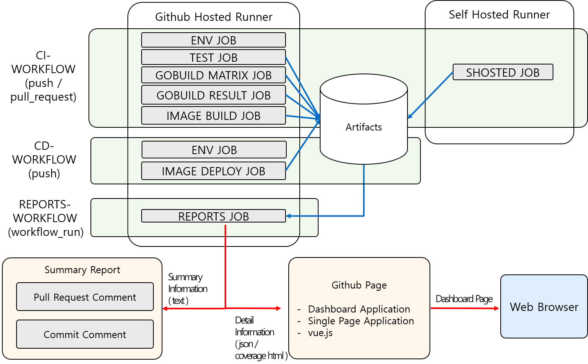
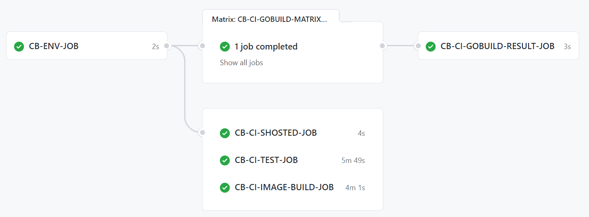
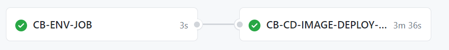
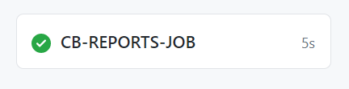
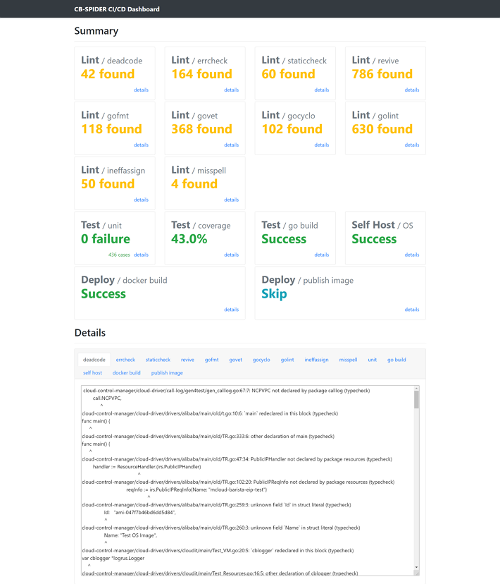

(작성중) 클라우드바리스타 CI/CD 설명 입니다.

비고: 본 문서는 배포후에 참조(링크)하시기 바랍니다. 문서의 최종 위치가 변경될 수 있습니다.

# Cloud-Barista CI/CD 설명

## [목 차]

1. [개요](#개요)
2. [CI/CD 란](#CI/CD-란)
3. [CI/CD 툴](#CI/CD-툴)
4. [GitHub Actions 구성](#GitHub-Actions-구성)
5. [Cloud-Barista CI/CD 전체 구조](#CI/CD-전체-구조)
6. [CI Workflow](#CI-Workflow)
7. [CD Workflow](#CD-Workflow)
8. [REPORTS Workflow](#REPORTS-Workflow)
9. [Summary Report](#Summary-Report)
10. [Dashboard](#Dashboard)

## [개요]

Cloud-Barista 시스템은 공개SW 개발 방안을 바탕으로 멀티 클라우드 기반의 다양한 서비스를 손쉽게 활용하고 신속히 개발할 수 있는 핵심 기술을 개발 중 이다. 국내외 불특정 다수의 기업 및 수요자의 접근이 용이하고, 현재 가장 많은 공개SW가 개발, 운영, 유지되고 있는 GitHub를 결과물 대외 공유 저장소로 활용한다. 향후 신규 기여자 수의 증가가 예측됨에 따라 새로운 코드 통합 시 개발 및 운영에 발생하는 문제를 해결하기 위한 자동화 도구 개발 및 적용이 필요하다.

Cloud-Barista 의 저장소로 활용되고 있는 GitHub 에서는 CI(Continuous Integration) / CD(Continuous Delivery/Continuous Deployment) 방법을 자동으로 제공할 수 있는 GitHub Actions 도구를 제공한다. GitHub Actions 을 이용하면 저장소에서 발생하는 이벤트를 이용하여 소스를 빌드, 테스트, 패키징, 배포 등을 자동화 처리할 수 있는 워크플로(Workflow) 를 만들 수 있다. 워크플로는 GitHub-hosted runner(GitHub 에서 호스팅하는 서버) / Self-hosted runner(사용자가 호스팅하는 서버) 의 Runner 에 의해 실행된다.

Cloud-Barista 의 개발 및 운영에 발생하는 문제를 해결하기 위한 CI/CD 자동화 도구로 GitHub 에서 제공하는 GitHub Actions 를 이용하며, Cloud-Barista 는 일원화된 GitHub 환경에서 워크플로를 사용하여 모든 과정을 통합적으로 관리할 수 있게 된다.

## [CI/CD 란]

CI/CD는 애플리케이션 개발 단계를 자동화하여 애플리케이션을 보다 짧은 주기로 고객에게 제공하는 방법이다. CI/CD의 기본 개념은 지속적인 통합, 지속적인 서비스 제공, 지속적인 배포이다. CI/CD는 새로운 코드 통합으로 인해 개발 및 운영팀에 발생하는 문제(일명 "인테그레이션 헬(integration hell)")을 해결하기 위한 솔루션이다.
CI/CD의 "CI"는 개발자를 위한 자동화 프로세스인 지속적인 통합(Continuous Integration)을 의미한다. CI를 성공적으로 구현할 경우 애플리케이션에 대한 새로운 코드 변경 사항이 정기적으로 빌드 및 테스트되어 공유 리포지토리에 통합되므로 여러 명의 개발자가 동시에 애플리케이션 개발과 관련된 코드 작업을 할 경우 서로 충돌할 수 있는 문제를 해결할 수 있다.
CI/CD의 "CD"는 지속적인 서비스 제공(Continuous Delivery) 및/또는 지속적인 배포(Continuous Deployment)를 의미하며 이 두 용어는 상호 교환적으로 사용된다. 두 가지 의미 모두 파이프라인의 추가 단계에 대한 자동화를 뜻하지만 때로는 얼마나 많은 자동화가 이루어지고 있는지를 설명하기 위해 별도로 사용되기도 한다.
지속적인 제공(Continuous Delivery)이란 개발자들이 애플리케이션에 적용한 변경 사항이 버그 테스트를 거쳐 리포지토리(예: GitHub 또는 컨테이너 레지스트리)에 자동으로 업로드되는 것을 뜻하며, 지속적인 배포(Continuous Deployment)란 개발자의 변경 사항을 리포지토리에서 고객이 사용 가능한 프로덕션 환경까지 자동으로 릴리스하는 것을 의미한다.

[[출처:RedHat](https://www.redhat.com/ko/topics/devops/what-is-ci-cd)]

## [CI/CD 툴]

CI/CD 솔루션은 Jenkins, Circle CI, Travis CI 등 많은 툴들이 존재한다. 하지만, Cloud-Barista 에서는 GitHub 저장소를 이용하고 있는 만큼 효율적인 CI/CD 를 구축하기 위해서 GitHub Actions 도구를 이용한다. GitHub Actions 은 [GitHub Market Place](https://github.com/marketplace?type=actions) 에서 많은 Action 을 이용할 수 있고, JavaScript 언어를 활용할 수도 있으며, Shell 도 지원하여 사용자가 원하는 프로그램도 설치하여 사용할 수 있는 확장성을 제공한다.
다음은 Cloud-Barista CI/CD에서 사용된 Action 들과 프로그램을 보여준다.

- actions/github-script@v4
- actions/setup-go@v2
- actions/upload-artifact@v2
- actions/download-artifact@v2
- actions/checkout@v2
- docker/setup-qemu-action@v1
- docker/setup-buildx-action@v1
- actions/cache@v2.1.4
- docker/login-action@v1
- docker/build-push-action@v2
- dawidd6/action-download-artifact@v2
- peter-evans/create-or-update-comment@v1
- peter-evans/commit-comment@v1
- golangci-lint
- go-junit-report
- openssl
- curl
- golang
- docker

## [GitHub Actions 구성]

GitHub Actions는 소프트웨어 개발 수명 주기 내에서 작업을 자동화하는 데 도움을 줄 수 있으며, 작동 방식은 이벤트 기반으로 작동한다. 다음 그림은 작업을 실행하기 위해 함께 작동하는 여러 GitHub Actions 구성 요소의 목록을 보여준다. 구성요소로는 Workflows, Events, Jobs, Steps, Actions, Runners 가 있다.

 

  

### (1) Workflows

Workflow는 리포지토리에 추가하는 자동화된 절차이다. 워크플로는 하나 이상의 Job으로 구성되며 Event에 의해 예약되거나 트리거될 수 있다. 워크플로는 GitHub에서 프로젝트를 빌드, 테스트, 패키지, 릴리스 또는 배포하는 데 사용할 수 있다.

### (2) Events

Event는 Workflow를 트리거하는 특정 활동을 의미한다. 예를 들어, 누군가가 커밋을 리포지토리에 푸시하거나, 이슈 또는 풀 요청이 생성될 때 GitHub에서 활동이 시작되게 된다. Workflow를 트리거하는 데 사용할 수 있는 이벤트의 전체 목록은 [여기](https://docs.github.com/en/actions/reference/events-that-trigger-workflows)를 참조한다.

### (3) Jobs

Job은 동일한 Runner에서 실행되는 일련의 단계이다. 기본적으로 여러 Job이 있는 Workflow는 해당 Job을 병렬로 실행한다. Job을 순차적으로 실행하도록 Workflow를 구성할 수도 있다.

### (4) Steps

Step은 Job에서 명령을 실행할 수 있는 개별 작업이다. Step은 Actions 또는 Shell 명령 일 수 있다 .

### (5) Actions

Action은 Job을 생성하는 Step으로 결합되는 독립 실행형 명령이다. Action은 Workflow의 가장 작은 구성 요소가 된다. 자신의 Action을 만들거나 GitHub 커뮤니티에서 만든 Action을 사용할 수 있다.

### (6) Runners

Runner는 GitHub Actions Runner 애플리케이션이 설치된 서버를 의미한다. Runner는 사용 가능한 Job을 수신 대기하고 한 번에 하나의 Job을 실행하며 진행 상황, 로그 및 결과를 다시 GitHub에 보고하는 역할을 한다. Runner 종류에는 Github에서 직접 호스팅해주는 Github-hosted Runner와 사용자가 직접 호스팅하는 Self-hosted Runner 가 있다.

[[출처:GitHub](https://docs.github.com/en/actions/learn-github-actions/introduction-to-github-actions)]

## [Cloud-Barista CI/CD 전체 구조]

다음 그림은 Cloud-Barista CI/CD 관련 전체 구조를 보여준다.
 

  

- 전체 설명 추가

## [CI Workflow]

다음 그림은 Cloud-Barista CI 관련 Job 들의 실행 관계를 보여준다.
 

  

CI Workflow 는 가장 먼저 ENV JOB 이 실행된다. 다른 Job 들은 ENV JOB 이 종료할 떄까지 대기한다. ENV JOB 이 종료하면 TEST JOB / GOBUILD MATRIX JOB / IMAGE BUILD JOB / SHOSTED JOB 들이 동시에 병렬로 실행한다. GOBUILD RESULT JOB 은 GOBUILD MATRIX JOB 이 종료되어야 실행된다.

### (1) ENV JOB

ENV JOB 은 다음 Step 들로 구성되어 있으며 순차적으로 실행된다.

- Check and configure environment variable
  - 설명 추가

### (2) TEST JOB

TEST JOB 은 다음 Step 들로 구성되어 있으며 순차적으로 실행된다.

- actions/checkout@v2
  - 설명 추가
- Make Output Folder
  - 설명 추가
- Setup Go
  - 설명 추가
- Setup golangci-lint
  - 설명 추가
- Find PR Number
  - 설명 추가
- Run Lint
  - 설명 추가
- Run Coverage
  - 설명 추가
- Upload Result
  - 설명 추가

### (3) GOBUILD MATRIX JOB

GOBUILD MATRIX JOB 은 다음 Step 들로 구성되어 있으며 순차적으로 실행된다.

- actions/checkout@v2
  - 설명 추가
- Make Output Folder
  - 설명 추가
- Setup Go
  - 설명 추가
- Run Build
  - 설명 추가
- Upload Result
  - 설명 추가

### (4) GOBUILD RESULT JOB

GOBUILD RESULT JOB 은 다음 Step 들로 구성되어 있으며 순차적으로 실행된다.

- Make Output Folder
  - 설명 추가
- actions/download-artifact@v2
  - 설명 추가
- Display structure of downloaded files
  - 설명 추가
- Merge Build Result
  - 설명 추가
- Upload Result
  - 설명 추가

### (5) IMAGE BUILD JOB

IMAGE BUILD JOB 은 다음 Step 들로 구성되어 있으며 순차적으로 실행된다.

- actions/checkout@v2
  - 설명 추가
- Make Output Folder
  - 설명 추가
- Build Image Test
  - 설명 추가
- Upload Result
  - 설명 추가

### (6) SHOSTED JOB

SHOSTED JOB 은 다음 Step 들로 구성되어 있으며 순차적으로 실행된다.

- Make Output Folder
  - 설명 추가
- Setup Go
  - 설명 추가
- Get OS Version
  - 설명 추가
- Upload Result
  - 설명 추가

## [CD Workflow]

다음 그림은 Cloud-Barista CD 관련 Job 들의 실행 관계를 보여준다.
 

  

CD Workflow 는 가장 먼저 ENV JOB 이 실행되고, ENV JOB 이 종료되면 IMAGE DEPLOY JOB 이 실행된다.

### (1) ENV JOB

ENV JOB 은 다음 Step 들로 구성되어 있으며 순차적으로 실행된다.

- Check and configure environment variable
  - 설명 추가

### (2) IMAGE DEPLOY JOB

IMAGE DEPLOY JOB 은 다음 Step 들로 구성되어 있으며 순차적으로 실행된다.

- actions/checkout@v2
  - 설명 추가
- Make Output Folder
  - 설명 추가
- Prepare Tags
  - 설명 추가
- Set up QEMU
  - 설명 추가
- Set up Docker Buildx
  - 설명 추가
- Cache Docker layers
  - 설명 추가
- Login to Docker Hub
  - 설명 추가
- Login to GitHub Container Registry
  - 설명 추가
- Build and publish
  - 설명 추가
- Publish Image Check
  - 설명 추가
- Upload Result
  - 설명 추가

## [REPORTS Workflow]

다음 그림은 Cloud-Barista CI/CD 결과를 레포팅하는 Job을 보여준다.
 

  

REPORTS Workflow 는 REPORTS JOB 의 단일 Job 으로 구성되어 있어 다른 Job 들과의 연관은 없다.

### (1) REPORTS JOB

REPORTS JOB 은 다음 Step 들로 구성되어 있으며 순차적으로 실행된다.

- Download cb-ci-actions-artifact
  - 설명 추가
- Download cb-cd-actions-artifact
  - 설명 추가
- Display structure of downloaded files
  - 설명 추가
- Load Result Info
  - 설명 추가
- Publish generated content without github clone
  - 설명 추가
- Publish Summary Results(PR)
  - 설명 추가
- Publish Summary Results(Push)
  - 설명 추가

## [Summary Report]

다음 그림은 CI/CD 의 요약된 레포팅 결과를 보여준다.
 

  

CI/CD Workflow 가 실행된 후 REPORTS JOB 에서 Pull Request 와 Commit 커멘트에 Summary Report를 사용자에게 제공한다. Summary Report 에서는 다음과 같은 정보가 표시되어 사용자는 전체적인 Workflow 실행 상태를 파악할 수 있게된다.

- Lint 에 의해 검사된 에러 수
- Code Coverage 퍼센트(%)
- Unit Test 결과
- Golang Build 결과
- Docker Build 결과
- Image Deploy 결과
- Self-hosted Runner 실행 결과
- Dashboard 로 링크 지원

## [Dashboard]

다음 그림은 Cloud-Barista CI/CD 의 레포팅 결과를 표시하는 Dashboard를 보여준다.
 

  

- 화면 설명
- json/html 업로드 위치
- dashboard app 구현 방법 간단 소개
