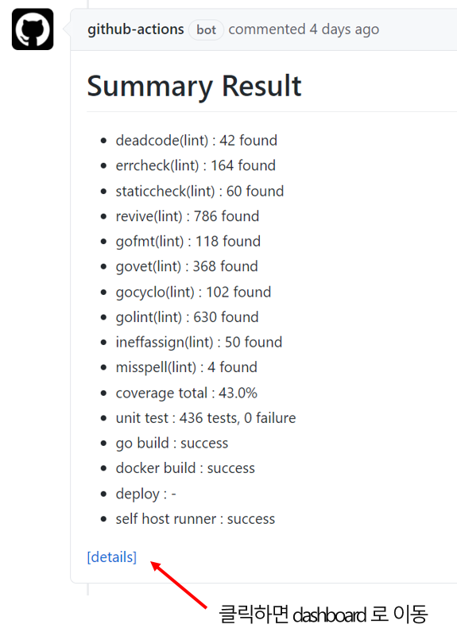

# Cloud-Barista 개발 워크플로 자동화 및 통합 리포트 체계

<ins>**Cloud-Barista 커뮤니티는 새로운 코드 통합으로 인해 발생하는 문제, 번거로운 반복작업에 대한 해결 방안으로 Cloud-Barista 개발 워크플로 자동화 및 통합 리포트 체계를 마련하였다.** (이후, 개발 워크플로 자동화는 통용되는 CI/CD로 표기)</ins>
이에, 본 문서에서 Cloud-Barista CI/CD 및 통합 리포트 전반에 대하여 설명하고자 한다.
먼저, CI/CD 및 통합 리포트 체계에 대해 소개하고 관련 내용을 설명한다.
다음으로, Cloud-Barista CI/CD 체계 및 세부 워크플로를 설명한다.
마지막으로, 통합 리포트 체계에 대해 설명한다.

- 지속적 통합(CI, Continuous Integration)
- 지속적 제공(CD, Continuous Delivery)
- 지속적 배포(CD, Continuous Deployment)

### 목 차

- [Cloud-Barista 개발 워크플로 자동화 및 통합 리포트 체계](#cloud-barista-개발-워크플로-자동화-및-통합-리포트-체계)
    - [목 차](#목-차)
  - [1. 개요](#1-개요)
    - [1.1. CI/CD 소개](#11-cicd-소개)
    - [1.2. CI/CD 도구](#12-cicd-도구)
    - [1.3. GitHub Actions 소개](#13-github-actions-소개)
      - [1.3.1. Workflows](#131-workflows)
      - [1.3.2. Events](#132-events)
      - [1.3.3. Jobs](#133-jobs)
      - [1.3.4. Steps](#134-steps)
      - [1.3.5. Actions](#135-actions)
      - [1.3.6. Runners](#136-runners)
    - [2. [구조] Cloud-Barista CI/CD 및 통합 리포트 체계](#2-구조-cloud-barista-cicd-및-통합-리포트-체계)
  - [3. CI/CD 체계 세부사항](#3-cicd-체계-세부사항)
    - [3.1. CI Workflow](#31-ci-workflow)
      - [3.1.1. ENV JOB](#311-env-job)
      - [3.1.2. TEST JOB](#312-test-job)
      - [3.1.3. GOBUILD MATRIX JOB](#313-gobuild-matrix-job)
      - [3.1.4. GOBUILD RESULT JOB](#314-gobuild-result-job)
      - [3.1.5. IMAGE BUILD JOB](#315-image-build-job)
      - [3.1.6. SHOSTED JOB](#316-shosted-job)
    - [3.2. CD Workflow](#32-cd-workflow)
      - [3.2.1. ENV JOB](#321-env-job)
      - [3.2.2. IMAGE DEPLOY JOB](#322-image-deploy-job)
  - [4. 통합 리포트 체계 세부사항](#4-통합-리포트-체계-세부사항)
    - [4.1. REPORTS Workflow](#41-reports-workflow)
      - [4.1.1. REPORTS JOB](#411-reports-job)
  - [4.2. Summary Report](#42-summary-report)
  - [4.3. Dashboard](#43-dashboard)

## 1. 개요

Cloud-Barista 시스템은 공개SW 개발 방안을 바탕으로 멀티클라우드 기반의 다양한 서비스를 손쉽게 활용하고 신속히 개발할 수 있는 핵심 기술을 개발 중 이다. 국내외 불특정 다수의 기업 및 수요자의 접근이 용이하고, 현재 가장 많은 공개SW가 개발, 운영, 유지되고 있는 GitHub를 결과물 대외 공유 저장소로 활용한다. 향후 신규 기여자 수의 증가가 예측됨에 따라 새로운 코드 통합 시 개발 및 운영에 발생하는 문제를 해결하기 위한 자동화 도구 개발 및 적용이 필요하다.

Cloud-Barista의 저장소로 활용되고 있는 GitHub 에서는 CI/CD 파이프라인을 뿐만아니라 그 이상의 개발 워크플로를 자동화 할 수 있는 GitHub Actions를 제공한다. 따라서, GitHub Actions을 이용하면 저장소에서 발생하는 이벤트를 이용하여 소스를 빌드, 테스트, 패키징, 배포 등을 자동화 처리할 수 있는 워크플로를 만들 수 있다. 만들어진 워크플로는 Runner라는 환경에서 수행되는데 GitHub Acions 에서 두 가지 Runner를 활용할 수 있다.

- GitHub-hosted runner: GitHub 에서 호스팅하는 서버
- Self-hosted runner: 사용자가 호스팅하는 서버
- 참고: [About GitHub-hosted runners](https://docs.github.com/en/actions/using-github-hosted-runners/about-github-hosted-runners), [About self-hosted runners](https://docs.github.com/en/actions/hosting-your-own-runners/about-self-hosted-runners)

다시말해, Cloud-Barista의 개발 및 운영에 발생하는 문제를 해결하기 위한 CI/CD 체계는 GitHub Actions를 통해 개발하며, 이를 통해 Cloud-Barista는 GitHub상에서 개발 워크플로 전 과정을 자동화하고 대시보드를 통해 통합적으로 관리할 수 있다.

### 1.1. CI/CD 소개

CI/CD는 애플리케이션 개발 단계를 자동화하여 애플리케이션을 보다 짧은 주기로 고객에게 제공하는 방법이다. CI/CD의 기본 개념은 지속적인 통합, 지속적인 서비스 제공, 지속적인 배포이다. CI/CD는 새로운 코드 통합으로 인해 개발 및 운영팀에 발생하는 문제(일명 "인테그레이션 헬(integration hell)")을 해결하기 위한 솔루션이다.
CI/CD의 "CI"는 개발자를 위한 자동화 프로세스인 지속적인 통합(Continuous Integration)을 의미한다. CI를 성공적으로 구현할 경우 애플리케이션에 대한 새로운 코드 변경 사항이 정기적으로 빌드 및 테스트되어 공유 리포지토리에 통합되므로 여러 명의 개발자가 동시에 애플리케이션 개발과 관련된 코드 작업을 할 경우 서로 충돌할 수 있는 문제를 해결할 수 있다.
CI/CD의 "CD"는 지속적인 서비스 제공(Continuous Delivery) 및/또는 지속적인 배포(Continuous Deployment)를 의미하며 이 두 용어는 상호 교환적으로 사용된다. 두 가지 의미 모두 파이프라인의 추가 단계에 대한 자동화를 뜻하지만 때로는 얼마나 많은 자동화가 이루어지고 있는지를 설명하기 위해 별도로 사용되기도 한다.
지속적인 제공(Continuous Delivery)이란 개발자들이 애플리케이션에 적용한 변경 사항이 버그 테스트를 거쳐 리포지토리(예: GitHub 또는 컨테이너 레지스트리)에 자동으로 업로드되는 것을 뜻하며, 지속적인 배포(Continuous Deployment)란 개발자의 변경 사항을 리포지토리에서 고객이 사용 가능한 프로덕션 환경까지 자동으로 릴리스하는 것을 의미한다.

[출처: RedHat](https://www.redhat.com/ko/topics/devops/what-is-ci-cd)

### 1.2. CI/CD 도구

CI/CD 솔루션은 Jenkins, Circle CI, Travis CI 등 많은 툴들이 존재한다. 하지만, Cloud-Barista 에서는 GitHub 저장소를 이용하고 있는 만큼 효율적인 CI/CD 를 구축하기 위해서 GitHub Actions 도구를 이용한다. GitHub Actions 은 [GitHub Market Place](https://github.com/marketplace?type=actions) 에서 많은 Action 을 이용할 수 있고, JavaScript 언어를 활용할 수도 있으며, Shell 도 지원하여 사용자가 원하는 프로그램도 설치하여 사용할 수 있는 확장성을 제공한다.
다음은 Cloud-Barista CI/CD에서 사용된 Action 들과 프로그램을 보여준다.

- actions/github-script@v4
- actions/setup-go@v2
- actions/upload-artifact@v2
- actions/download-artifact@v2
- actions/checkout@v2
- docker/setup-qemu-action@v1
- docker/setup-buildx-action@v1
- actions/cache@v2.1.4
- docker/login-action@v1
- docker/build-push-action@v2
- dawidd6/action-download-artifact@v2
- peter-evans/create-or-update-comment@v1
- peter-evans/commit-comment@v1
- golangci-lint
- go-junit-report
- openssl
- curl
- golang
- docker

### 1.3. GitHub Actions 소개

GitHub Actions는 소프트웨어 개발 수명 주기 내에서 작업을 자동화하는 데 도움을 줄 수 있으며, 작동 방식은 이벤트 기반으로 작동한다. 다음 그림은 작업을 실행하기 위해 함께 작동하는 여러 GitHub Actions 구성 요소의 목록을 보여준다. 구성요소로는 Workflows, Events, Jobs, Steps, Actions, Runners 가 있다.

<br/>

<br/><br/>

#### 1.3.1. Workflows

Workflow는 리포지토리에 추가하는 자동화된 절차이다. 워크플로는 하나 이상의 Job으로 구성되며 Event에 의해 예약되거나 트리거될 수 있다. 워크플로는 GitHub에서 프로젝트를 빌드, 테스트, 패키지, 릴리스 또는 배포하는 데 사용할 수 있다.

#### 1.3.2. Events

Event는 Workflow를 트리거하는 특정 활동을 의미한다. 예를 들어, 누군가가 커밋을 리포지토리에 푸시하거나, 이슈 또는 풀 요청이 생성될 때 GitHub에서 활동이 시작되게 된다. Workflow를 트리거하는 데 사용할 수 있는 이벤트의 전체 목록은 [여기](https://docs.github.com/en/actions/reference/events-that-trigger-workflows)를 참조한다.

#### 1.3.3. Jobs

Job은 동일한 Runner에서 실행되는 일련의 단계이다. 기본적으로 여러 Job이 있는 Workflow는 해당 Job을 병렬로 실행한다. Job을 순차적으로 실행하도록 Workflow를 구성할 수도 있다.

#### 1.3.4. Steps

Step은 Job에서 명령을 실행할 수 있는 개별 작업이다. Step은 Actions 또는 Shell 명령 일 수 있다 .

#### 1.3.5. Actions

Action은 Job을 생성하는 Step으로 결합되는 독립 실행형 명령이다. Action은 Workflow의 가장 작은 구성 요소가 된다. 자신의 Action을 만들거나 GitHub 커뮤니티에서 만든 Action을 사용할 수 있다.

#### 1.3.6. Runners

Runner는 GitHub Actions Runner 애플리케이션이 설치된 서버를 의미한다. Runner는 사용 가능한 Job을 수신 대기하고 한 번에 하나의 Job을 실행하며 진행 상황, 로그 및 결과를 다시 GitHub에 보고하는 역할을 한다. Runner 종류에는 Github에서 직접 호스팅해주는 Github-hosted Runner와 사용자가 직접 호스팅하는 Self-hosted Runner 가 있다.

[[출처:GitHub](https://docs.github.com/en/actions/learn-github-actions/introduction-to-github-actions)]

### 2. [구조] Cloud-Barista CI/CD 및 통합 리포트 체계

다음 그림은 Cloud-Barista CI/CD 및 통합 리포트 관련 전체 구조를 보여준다.
<br/>

<br/><br/>

- Workflows
  - CI-WORKFLOW : CI 관련 작업을 수행하는 워크플로우
  - CD-WORKFLOW : CD 관련 작업을 수행하는 워크플로우
  - REPORTS-WORKFLOW : CI/CD 작업 결과를 레포팅 관련 작업을 하는 워크플로우
- Events
  - pull_request : CI-WORKFLOW 를 트리거하는 이벤트
  - push : main / master 브랜치에 대해서는 CD-WORKFLOW 를 트리거하고, main / master 를 제외한 브랜치에 대해서는 CI-WORKFLOW 를 트리거하는 이벤트
  - workflow_run : REPORTS-WORKFLOW 를 트리거하는 이벤트
- Jobs
  - ENV JOB : 워크를로우에 필요한 환경 변수 설정 작업 수행
  - TEST JOB : Lint / Unit Test 의 작업 수행
  - GOBUILD MATRIX JOB : 다양한 golang 버전의 build 작업 수행
  - GOBUILD RESULT JOB : GOBUILD MATRIX JOB 의 결과를 하나로 통합하는 작업 수행
  - IMAGE BUILD JOB : docker build 작업 수행
  - IMAGE DEPLOY JOB : Docker Hub / GitHub Container Registry 에 이미지 배포 작업 수행
  - SHOSTED JOB : 사용자가 직접 호스팅하는 서버에서 수행이 필요한 업무를 위해 만들어 놓은 작업 공간
  - REPORTS JOB : CI/CD 작업 결과를 레포팅에 필요한 데이터로 가공하여 Summary Report / Dashboard 에 전달하는 작업 수행
- Runners
  - Github Hosted Runner : SHOSTED JOB 을 제외한 모든 Job 들은 GitHub 에서 호스팅하는 Runner 에서 수행됨
  - Self Hosted Runner : GitHub 에서 호스팅하는 Runner 에서 수행이 불가능한 작업을 확장하기 위해 제공되는 Runner로 SHOSTED JOB 를 수행함
- Artifacts
  - Workflow 또는 Job 간의 데이터 공유를 위해 파일을 저장하는 장소
  - 모든 Job 의 결과는 Artifacts 로 업로드하여 결과를 공유
- Summary Report
  - REPORTS JOB 에서 생성된 CI/CD 의 요약된 결과로 Pull Request / Commit 커멘트에 제공됨
- Github Pages
  - Dashboard Application 을 위해 사용된 Github에서 바로 웹페이지를 호스팅할 수 있게 제공하는 서비스

## 3. CI/CD 체계 세부사항

### 3.1. CI Workflow

Cloud-Barista CI Workflow 는 ENV JOB / TEST JOB / GOBUILD MATRIX JOB / GOBUILD RESULT JOB / IMAGE BUILD JOB / SHOSTED JOB 으로 구성되어 있으며, push / pull_request 이벤트가 트리거 될 때 작동하게 된다. 전체 CI Workflow 내용은 [cb-ci-actions.yaml](https://github.com/cloud-barista/poc-cicd-spider/blob/master/.github/workflows/cb-ci-actions.yaml) 파일을 참고한다. 다음은 CI Workflow 전체 구조를 보여준다.

```
name: CB-CI-ACTIONS-WORKFLOW // Workflow 이름 지정

on: // Workflow 이벤트 트리거 조건 지정
  push:
    branches-ignore: //  main / master 브랜치가 아닐 경우 트리거 발생
      - main
      - master
    paths: // *.go 파일과 .github 폴더 아래의 파일이 수정될 때 만 작동
      - "**.go"
      - ".github/**"
  pull_request:
    paths:
      - "**.go"
      - ".github/**"

jobs: // Workflow Job 지정
  cb-env-job:
  cb-ci-shosted-job:
  cb-ci-test-job:
  cb-ci-gobuild-matrix-job:
  cb-ci-gobuild-result-job:
  cb-ci-image-build-job:
```

다음 그림은 Cloud-Barista CI 관련 Job 들의 실행 관계를 보여준다.
<br/>

<br/><br/>

CI Workflow 는 가장 먼저 ENV JOB 이 실행된다. 다른 Job 들은 ENV JOB 이 종료할 떄까지 대기한다. ENV JOB 이 종료하면 TEST JOB / GOBUILD MATRIX JOB / IMAGE BUILD JOB / SHOSTED JOB 들이 동시에 병렬로 실행한다. GOBUILD RESULT JOB 은 GOBUILD MATRIX JOB 이 종료되어야 실행된다.

#### 3.1.1. ENV JOB

ENV JOB은 Workflow에 필요한 skip_tags 환경 변수 설정 작업을 수행하며, branch / author_association 환경 변수는 주석 처리되어 있다. 다음은 ENV JOB 전체 구조를 보여준다.

```
  cb-env-job:
    name: CB-ENV-JOB // Job 이름 지정
    if: ${{ github.repository_owner == 'cloud-barista' }} // Fork Repository 에서는 작동하지 않도록 조건 지정
    runs-on: ubuntu-latest // Job 실행 환경 지정
    outputs: // 다른 Job 에게 전달할 정보 지정
      #branch: ${{ steps.cev.outputs.branch }}
      #author_association: ${{ steps.cev.outputs.author_association }}
      skip_tags: ${{ steps.cev.outputs.steps.cev.outputs.skip_tags }}
    steps: // Job 의 Step 들 지정
      - name: Check and configure environment variable
```

ENV JOB 은 다음 Step 들로 구성되어 있으며 순차적으로 실행된다.

- Check and configure environment variable

  본 Step 은 다음처럼 actions/github-script@v4 을 이용하여 Javascript 로 구현되어 있으며, skip_tags / author_association / branch 환경 변수 값을 설정하는 일을 수행한다. author_association / branch 는 주석처리 되어 있지만 사용자의 필요에 의해 활용될 수 있다.

  ```
  - name: Check and configure environment variable
    uses: actions/github-script@v4
  ```

  - skip_tags : PR 메시지나 Commit 메시지에 대괄호[] 를 사용하여 지정할 수 있고 여러개를 지정할 수 있다. 지정된 대괄호는 정규식을 통하여 추출되며 skip_tags 변수에 문자열 형태로 저장되게 된다. 예로, SHOSTED JOB 의 실행 여부를 skip_tags 를 이용하여 제어해야 한다고 가정하자. 사용자는 PR 메시지나 Commit 메시지 에 "[skip shosted] add something..." 로 지정하면, skip_tags 변수에 "[skip shosted]" 값이 설정되고, skip_tags 변수를 SHOSTED JOB 에서 다음처럼 실행 조건을 지정하여 제어할 수 있다. SHOSTED JOB 에서 skip_tags 변수를 활용하기 위해서는 needs.cb-env-job.outputs.skip_tags 처럼 설정해야 한다.
    ```
      cb-ci-shosted-job:
        name: CB-CI-SHOSTED-JOB
        needs: [cb-env-job] // cb-env-job 이 실행이 종료될 때까지 대기함
        if: ${{ github.repository_owner == 'cloud-barista' && !contains(needs.cb-env-job.outputs.skip_tags, '[skip shosted]') }}
    ```
  - author_association : 이벤트 트리거에 상관없이 동일하게 로그인한 사용자의 권한을 OWNER / MEMBER / COLLABORATOR 으로 구분하여 제공한다.
  - branch : 이벤트 트리거에 상관없이 동일하게 branch 이름을 제공한다.

#### 3.1.2. TEST JOB

TEST JOB은 Lint / Unit Test 의 작업을 수행하며, 작업 결과를 레포팅하기 위해 Artifacts 저장소에 업로드한다. 다음은 TEST JOB 전체 구조를 보여준다.

```
  cb-ci-test-job:
    name: CB-CI-TEST-JOB // Job 이름 지정
    if: ${{ github.repository_owner == 'cloud-barista' }} // Fork Repository 에서는 작동하지 않도록 조건 지정
    runs-on: ubuntu-latest // Job 실행 환경 지정
    needs: [cb-env-job] // cb-env-job 이 실행이 종료될 때까지 대기함
    steps: // Job 의 Step 들 지정
      - uses: actions/checkout@v2
      - name: Make Output Folder
      - name: Setup Go
      - name: Setup golangci-lint
      - name: Find PR Number
      - name: Run Lint
      - name: Run Coverage
      - name: Upload Result
```

TEST JOB 은 다음 Step 들로 구성되어 있으며 순차적으로 실행된다.

- actions/checkout@v2

  actions/checkout@v2 을 이용하여 Repository 에서 소스코드를 체크아웃한다.

- Make Output Folder

  outputs 폴더를 생성한다. 다음 Step 의 결과물은 모두 outputs 폴더에 위치하게 된다.

- Setup Go

  actions/setup-go@v2 이용하여 1.16 golang 을 설치한다.

- Setup golangci-lint

  Cloud-Barista 에서 Lint 을 수행하기 위해 사용되는 golangci-lint 를 설치한다.

- Find PR Number

  actions/github-script@v4 를 이용하여 pull request number 를 구하여 pr_number.txt 파일에 저장한다. pr_number.txt 은 REPORTS JOB 으로 전달되며 Pull Request 커맨트에 Summary Report 를 생성할 때 이용한다.

- Run Lint

  [golangci-lint](https://github.com/golangci/golangci-lint)는 golang 에서 사용할 수 있는 다양한 Lint 를 통합하여 제공하고 있어 새로운 Lint 를 적용하는데 있어 쉽게 확장할 수 있다. 현재 Cloud-Barista 에서는 deadcode / errcheck / staticcheck / revive / gofmt / govet / gocyclo / golint / ineffassign / misspell 을 제공한다. golangci-lint 의 환경설정은 [.golangci.yaml](https://github.com/cloud-barista/poc-cicd-spider/blob/master/.github/.golangci.yaml) 파일에서 수정할 수 있다. 제공하는 Lint 이외의 것을 추가하고자 할 경우 golangci-lint 툴이 제공하고 있는 [Lint 목록](https://golangci-lint.run/usage/linters/)을 참조한다. 다음은 각 Lint 를 실행하고 실행결과를 파일에 저장하는 명령어를 보여주며, 실행결과 파일은 REPORTS JOB 으로 전달된다.

  ```
  - name: Run Lint
    run: |
      golangci-lint run --config ./.github/.golangci.yaml --disable-all -E deadcode | tee ./outputs/deadcode-lint-result.txt
      golangci-lint run --config ./.github/.golangci.yaml --disable-all -E errcheck | tee ./outputs/errcheck-lint-result.txt
      golangci-lint run --config ./.github/.golangci.yaml --disable-all -E staticcheck | tee ./outputs/staticcheck-lint-result.txt
      golangci-lint run --config ./.github/.golangci.yaml --disable-all -E revive | tee ./outputs/revive-lint-result.txt
      golangci-lint run --config ./.github/.golangci.yaml --disable-all -E gofmt | tee ./outputs/gofmt-lint-result.txt
      golangci-lint run --config ./.github/.golangci.yaml --disable-all -E govet | tee ./outputs/govet-lint-result.txt
      golangci-lint run --config ./.github/.golangci.yaml --disable-all -E gocyclo | tee ./outputs/gocyclo-lint-result.txt
      golangci-lint run --config ./.github/.golangci.yaml --disable-all -E golint | tee ./outputs/golint-lint-result.txt
      golangci-lint run --config ./.github/.golangci.yaml --disable-all -E ineffassign | tee ./outputs/ineffassign-lint-result.txt
      golangci-lint run --config ./.github/.golangci.yaml --disable-all -E misspell | tee ./outputs/misspell-lint-result.txt
  ```

- Run Coverage

  본 Step 은 Unit Test 시나리오를 실행하고 소스코드의 커버리지를 구하는 일을 수행한다. 다음은 Cloud-Barista 의 Unit Test 구조를 보여준다. Unit Test 는 입력과 출력을 기준으로 블랙박스 테스트를 기본으로 하고 있으며, REST API / Go API / CLI 인터페이스를 테스트한다. Unit Test 시나리오마다 테스트 환경을 새롭게 구성하고 있고, port / meta_db 등은 충돌 방지를 위해 Unit Test 에서 별도로 사용 가능하게 구성한다.

  <br/>
  
  <br/><br/>

  예로, CB-SPIDER 의 Unit Test 시나리오는 poc-cicd-spier 의 [test/interface-test](https://github.com/cloud-barista/poc-cicd-spider/tree/master/test/interface-test) 에 구현되어 있으며 다음과 같은 소스트리를 보여준다.

  - test.env : Unit Test 를 위한 독립적인 환경 변수 설정
  - test.sh : Unit Test 를 실행하는 script
  - conf : Unit Test 를 위한 독립적인 config 정보 설정
  - rest-scenario : REST API 시나리오
  - go-scenario : GO API 시나리오
  - cli-scenario : CLI 시나리오
  - rest-go-equal-scenario : REST API 와 GO API 출력 비교 시나리오

  다음은 CB-SPIDER 의 Unit Test 를 Workflow 에서 실행하기 위해서는 다음과 같이 Workflow 환경에 맞게 수정한다. Unit Test 결과는 모두 outputs 폴더에 저장되며, outputs 폴더의 파일은 REPORTS JOB 으로 전달된다.

  ```
  - name: Run Coverage
    env: // test.env 환경을 Workflow 환경에 맞게 수정
      CBSPIDER_ROOT: ${{ github.workspace }}/test/interface-test
      CBSTORE_ROOT: ${{ github.workspace }}/test/interface-test
      CBLOG_ROOT: ${{ github.workspace }}/test/interface-test
      LOCALHOST: OFF
      PLUGIN_SW: OFF
      MEERKAT: OFF
    run: |
      cd ${{ github.workspace }}/test/interface-test // Unit Test 폴더로 이동
      (go test -p 1 -v -coverpkg=$(go list ../../... | grep -v interface-test | grep -v protobuf | tr "\n" ",")  -coverprofile=../../outputs/coverage.txt ./... > ../../outputs/coverage.log 2>&1; echo $? > ../../outputs/coverage.check ) || true  // Unit Test 결과를 파일에 저장

      cd ${{ github.workspace }}

      (go tool cover -html=./outputs/coverage.txt -o ./outputs/coverage.html) || true // 커버리지를 html 로 저장
      (go tool cover -func ./outputs/coverage.txt | grep total | awk '{print $3}' > ./outputs/coverage.total) || true // 커버리지 퍼센트 저장
      go get -u github.com/jstemmer/go-junit-report
      cat ./outputs/coverage.log | go-junit-report > ./outputs/unit-tests.xml // 커버리지 결과를 xml 로 저장
  ```

  - go test 명령어
    - -p 1 : test package 를 병렬로 1개씩 실행함. 여러개를 실행하면 port / meta_db 등이 충돌하게 됨
    - -coverpkg : test 대상 package 를 지정함. grep -v 를 이용하여 test 대상 package 를 제외할 수 있음
    - -coverprofile : cover profile 저장 파일
  - coverage.txt : go test 가 실행한 cover profile 정보
  - coverage.log : go test 가 실행한 출력 결과 정보
  - coverage.check : go test 실행 종료 상태
  - coverage.html : Dashboard 에서 보여줄 html 커버리지 정보
  - coverage.total : Dashboard 에서 보여줄 커버리지 퍼센트 정보
  - unit-tests.xml : go test 성공/실패 카운팅을 위한 xml 변환 정보

- Upload Result

  actions/upload-artifact@v2 을 이용하여 outputs 폴더에 있는 파일을 cb-artifact-test 로 압축하여 Artifacts 로 업로드한다.

#### 3.1.3. GOBUILD MATRIX JOB

GOBUILD MATRIX JOB은 다양한 golang 버전의 build 작업을 수행하며, 작업 결과를 GOBUILD RESULT JOB 으로 전달하기 위해 Artifacts 저장소에 업로드한다. 다음은 GOBUILD MATRIX JOB 전체 구조를 보여준다.

```
  cb-ci-gobuild-matrix-job:
    name: CB-CI-GOBUILD-MATRIX-JOB // Job 이름 지정
    if: ${{ github.repository_owner == 'cloud-barista' }} // Fork Repository 에서는 작동하지 않도록 조건 지정
    runs-on: ubuntu-latest // Job 실행 환경 지정
    needs: [cb-env-job] // cb-env-job 이 실행이 종료될 때까지 대기함
    strategy:
      matrix:
        go: ["1.16"] // golang 버전을 배열로 추가할 경우(ex, ["1.16", "1.15"] ), 자동으로 지정된 golang 버전에 따른 여러 Job 이 실행됨
    steps: // Job 의 Step 들 지정
      - uses: actions/checkout@v2
      - name: Make Output Folder
      - name: Setup Go
      - name: Run Build
      - name: Upload Result
```

GOBUILD MATRIX JOB 은 다음 Step 들로 구성되어 있으며 순차적으로 실행된다.

- actions/checkout@v2

  actions/checkout@v2 을 이용하여 Repository 에서 소스코드를 체크아웃한다.

- Make Output Folder

  outputs 폴더를 생성한다. 다음 Step 의 결과물은 모두 outputs 폴더에 위치하게 된다.

- Setup Go

  actions/setup-go@v2 이용하여 matrix.go 에 지정된 golang 을 설치한다.

- Run Build

  matrix.go 에서 지정된 golang 으로 build 한 결과를 build.log, build.check 파일로 outputs 폴더에 저장한다.

- Upload Result

  actions/upload-artifact@v2 을 이용하여 outputs 폴더에 있는 파일을 cb-artifact-gobuild-${{ matrix.go }} 로 압축하여 Artifacts 로 업로드한다. 즉, cb-artifact-gobuild-${{ matrix.go }} 은 현재 matrix 에 1.16 한개만 존재하므로 cb-artifact-gobuild-1.16 로 업로드된다.

#### 3.1.4. GOBUILD RESULT JOB

GOBUILD RESULT JOB은 GOBUILD MATRIX JOB 의 결과를 하나로 통합하는 작업을 수행하며, 작업 결과를 레포팅하기 위해 Artifacts 저장소에 업로드한다. GOBUILD RESULT JOB은 GOBUILD MATRIX JOB 이 모두 실행이 종료된 다음 수행된다. 다음은 GOBUILD RESULT JOB 전체 구조를 보여준다.

```
  cb-ci-gobuild-result-job:
    name: CB-CI-GOBUILD-RESULT-JOB // Job 이름 지정
    if: ${{ github.repository_owner == 'cloud-barista' }} // Fork Repository 에서는 작동하지 않도록 조건 지정
    runs-on: ubuntu-latest // Job 실행 환경 지정
    needs: [cb-env-job, cb-ci-gobuild-matrix-job] // cb-env-job 과 cb-ci-gobuild-matrix-job 이 실행이 종료될 때까지 대기함
    outputs: // 다른 Job 에게 전달할 정보 지정
      go_build_check: ${{ steps.mergeresult.outputs.go_build_check }}
    steps: // Job 의 Step 들 지정
      - name: Make Output Folder
      - uses: actions/download-artifact@v2
      - name: Display structure of downloaded files
      - name: Merge Build Result
      - name: Upload Result
```

GOBUILD RESULT JOB 은 다음 Step 들로 구성되어 있으며 순차적으로 실행된다.

- Make Output Folder

  outputs 폴더를 생성한다. 다음 Step 의 결과물은 모두 outputs 폴더에 위치하게 된다.

- actions/download-artifact@v2

  GOBUILD MATRIX JOB 의 업로드 파일을 가져오기 위해 본 Workflow 에 저장되어 있는 모든 파일을 다운로드한다.

- Display structure of downloaded files

  GOBUILD MATRIX JOB 의 업로드 파일을 제대로 가져왔는지 확인하기 위해 cb-artifact-gobuild-\* 파일 목록을 출력한다.

  ```
  - name: Display structure of downloaded files
    run: ls -R ./cb-artifact-gobuild-*
  ```

- Merge Build Result

  모든 cb-artifact-gobuild-\*/build.check 파일들을 outputs/build.check 파일 하나로 통합하고, 모든 cb-artifact-gobuild-\*/build.log 파일들을 outputs/build.log 파일 하나로 통합한다.

- Upload Result

  actions/upload-artifact@v2 을 이용하여 outputs 폴더에 있는 파일을 cb-artifact-gobuild 로 압축하여 Artifacts 로 업로드한다.

#### 3.1.5. IMAGE BUILD JOB

IMAGE BUILD JOB은 docker build 작업을 수행하며, 작업 결과를 레포팅하기 위해 Artifacts 저장소에 업로드한다. 다음은 IMAGE BUILD JOB 전체 구조를 보여준다.

```
  cb-ci-image-build-job:
    name: CB-CI-IMAGE-BUILD-JOB // Job 이름 지정
    if: ${{ github.repository_owner == 'cloud-barista' }} // Fork Repository 에서는 작동하지 않도록 조건 지정
    runs-on: ubuntu-latest // Job 실행 환경 지정
    needs: [cb-env-job] // cb-env-job 이 실행이 종료될 때까지 대기함
    steps: // Job 의 Step 들 지정
      - uses: actions/checkout@v2
      - name: Make Output Folder
      - name: Build Image Test
      - name: Upload Result
```

IMAGE BUILD JOB 은 다음 Step 들로 구성되어 있으며 순차적으로 실행된다.

- actions/checkout@v2

  actions/checkout@v2 을 이용하여 Repository 에서 소스코드를 체크아웃한다.

- Make Output Folder

  outputs 폴더를 생성한다. 다음 Step 의 결과물은 모두 outputs 폴더에 위치하게 된다.

- Build Image Test

  Dockerfile 을 docker build 명령어로 실행하여 이미지를 생성하는지 확인한다. docker build 결과는 dockerbuild.log, dockerbuild.check 로 outputs 폴더에 저장된다.

- Upload Result

  actions/upload-artifact@v2 을 이용하여 outputs 폴더에 있는 파일을 cb-artifact-image-build 로 압축하여 Artifacts 로 업로드한다.

#### 3.1.6. SHOSTED JOB

SHOSTED JOB은 사용자가 호스팅하는 서버의 OS 버전을 구하는 작업을 수행하며, 작업 결과를 레포팅하기 위해 Artifacts 저장소에 업로드한다. 다음은 SHOSTED JOB 전체 구조를 보여준다. 현재 SHOSTED JOB은 간단한 예로 구성한 상태로 사용자가 원하는 작업으로 수정하여 활용할 수 있다.

```
  cb-ci-shosted-job:
    name: CB-CI-SHOSTED-JOB // Job 이름 지정
    if: ${{ github.repository_owner == 'cloud-barista' }} // Fork Repository 에서는 작동하지 않도록 조건 지정
    runs-on: [self-hosted, linux, X64] // Self-hosted 실행 환경 지정
    needs: [cb-env-job] // cb-env-job 이 실행이 종료될 때까지 대기함
    steps: // Job 의 Step 들 지정
      - name: Make Output Folder
      - name: Setup Go
      - name: Get OS Version
      - name: Upload Result
```

SHOSTED JOB 은 다음 Step 들로 구성되어 있으며 순차적으로 실행된다.

- Make Output Folder

  outputs 폴더를 생성한다. 다음 Step 의 결과물은 모두 outputs 폴더에 위치하게 된다.

- Setup Go

  actions/setup-go@v2 이용하여 1.16 golang 을 설치한다.

- Get OS Version

  uname 명령어로 사용자 호스팅 서버의 버전 정보를 outputs 폴더의 selfhost.log, selfhost.check 파일에 저장한다.

- Upload Result

  actions/upload-artifact@v2 을 이용하여 outputs 폴더에 있는 파일을 cb-artifact-shosted 로 압축하여 Artifacts 로 업로드한다.

### 3.2. CD Workflow

Cloud-Barista CD Workflow 는 ENV JOB / IMAGE DEPLOY JOB 으로 구성되어 있으며, push 이벤트가 트리거 될 때 작동하게 된다. 전체 CD Workflow 내용은 [cb-cd-actions.yaml](https://github.com/cloud-barista/poc-cicd-spider/blob/master/.github/workflows/cb-cd-actions.yaml) 파일을 참고한다. 다음은 CD Workflow 전체 구조를 보여준다.

```
name: CB-CD-ACTIONS-WORKFLOW // Workflow 이름 지정

on: // Workflow 이벤트 트리거 조건 지정
  push:
    branches: //  main / master 브랜치일 경우 트리거 발생
      - main
      - master
    tags: //  v*.*.* 태깅이 될 경우 트리거 발생
      - v*.*.*

jobs: // Workflow Job 지정
  cb-env-job:
  cb-cd-image-deploy-job:
```

다음 그림은 Cloud-Barista CD 관련 Job 들의 실행 관계를 보여준다.
<br/>

<br/><br/>

CD Workflow 는 가장 먼저 ENV JOB 이 실행되고, ENV JOB 이 종료되면 IMAGE DEPLOY JOB 이 실행된다.

#### 3.2.1. ENV JOB

Cloud-Barista CI Workflow 의 ENV JOB 과 동일하다.

#### 3.2.2. IMAGE DEPLOY JOB

IMAGE DEPLOY JOB은 Docker Hub / GitHub Container Registry 에 이미지 배포 작업을 수행하며, 작업 결과를 레포팅하기 위해 Artifacts 저장소에 업로드한다. 다음은 IMAGE DEPLOY JOB 전체 구조를 보여준다.

```
  cb-cd-image-deploy-job:
    name: CB-CD-IMAGE-DEPLOY-JOB // Job 이름 지정
    if: ${{ github.repository_owner == 'cloud-barista' }} // Fork Repository 에서는 작동하지 않도록 조건 지정
    runs-on: ubuntu-latest // Job 실행 환경 지정
    needs: [cb-env-job] // cb-env-job 이 실행이 종료될 때까지 대기함
    env:
      DOCKER_REPO: cloudbaristaorg
      IMAGE_NAME: poc-cicd-spider // 배포할 이미지 이름 지정
    steps: // Job 의 Step 들 지정
      - uses: actions/checkout@v2
      - name: Make Output Folder
      - name: Prepare Tags
      - name: Set up QEMU
      - name: Set up Docker Buildx
      - name: Login to Docker Hub
      - name: Login to GitHub Container Registry
      - name: Build and publish
      - name: Publish Image Check
      - name: Upload Result
```

IMAGE DEPLOY JOB 은 다음 Step 들로 구성되어 있으며 순차적으로 실행된다.

- actions/checkout@v2

  actions/checkout@v2 을 이용하여 Repository 에서 소스코드를 체크아웃한다.

- Make Output Folder

  outputs 폴더를 생성한다. 다음 Step 의 결과물은 모두 outputs 폴더에 위치하게 된다.

- Prepare Tags

  Docker Hub / GitHub Container Registry 에 배포하기 위한 태깅 정보를 구하여 docker-image / docker-tags / ghcr-image / ghcr-tags 변수에 저장하는 일을 수행한다. 저장된 변수는 steps.prep.outputs.ghcr-tags 처럼 steps.prep.outputs. 다음에 변수명을 지정하여 사용할 수 있다.

  ```
  - name: Prepare Tags
    id: prep
    run: |
      DOCKER_IMAGE=$DOCKER_REPO/$IMAGE_NAME
      DOCKER_TAGS="${DOCKER_IMAGE}:${VERSION}"
      echo ::set-output name=docker-image::${DOCKER_IMAGE}
      echo ::set-output name=docker-tags::${DOCKER_TAGS}

      GHCR_IMAGE=ghcr.io/${{ github.repository_owner }}/$IMAGE_NAME
      GHCR_TAGS="${GHCR_IMAGE}:${VERSION}"
      echo ::set-output name=ghcr-image::${GHCR_IMAGE}
      echo ::set-output name=ghcr-tags::${GHCR_TAGS}
  ```

- Set up QEMU

  docker/setup-qemu-action@v1 를 이용하여 QEMU 에뮬레이터를 설치한다.

- Set up Docker Buildx

  docker/setup-buildx-action@v1 를 이용하여 Docker Buildx 를 설치한다.

- Cache Docker layers

  actions/cache@v2.1.4 를 이용하여 Dokcer Build 할 때 캐시를 사용할 수 있도록 구성한다.

- Login to Docker Hub

  docker/login-action@v1 를 이용하여 Docker Hub 에 로그인한다. Secrets 변수 DOCKER_USERNAME, DOCKER_PASSWORD 가 설정되어 있어야 한다. poc-cicd-spider 에서는 주석처리 되어 있으며, 실제 사용시에는 주석을 제거하고 사용한다.

  ```
  #- name: Login to Docker Hub
  #  uses: docker/login-action@v1
  #  with:
  #    username: ${{ secrets.DOCKER_USERNAME }}
  #    password: ${{ secrets.DOCKER_PASSWORD }}
  ```

- Login to GitHub Container Registry

  docker/login-action@v1 를 이용하여 GitHub Container Registry 에 로그인한다. Secrets 변수 CR_PAT 가 설정되어 있어야 한다.

- Build and publish

  docker/build-push-action@v2 를 이용하여 이미지를 생성하고 Docker Hub / GitHub Container Registry 에 배포한다. poc-cicd-spider 에서는 GitHub Container Registry 만 배포하도록 설정되어 있다.

  ```
  tags: | // GitHub Container Registry 에만 배포함
    ${{ steps.prep.outputs.ghcr-tags }}
  #tags: | // Docker Hub / GitHub Container Registry 모두에 배포함
  #  ${{ steps.prep.outputs.docker-tags }}
  #  ${{ steps.prep.outputs.ghcr-tags }}
  ```

- Publish Image Check

  "Build and publish" 의 Step 에서 배포된 이미지의 digest 출력 값(steps.imgpublish.outputs.digest)을 가지고 제대로 배포되었는지 docker pull 을 이용하여 로컬로 가져오는 검사를 수행한다. GitHub Container Registry 의 배포 결과는 ghcrpublish.log, ghcrpublish.check 파일로, Docker Hub 배포결과는 dockerpublish.log, dockerpublish.check 파일로 outputs 폴더에 저장된다.

  ```
  - name: Publish Image Check
    id: imgcheck
    run: |
      (docker pull ${{ steps.prep.outputs.ghcr-tags }}@${{ steps.imgpublish.outputs.digest }} > ./outputs/ghcrpublish.log 2>&1; echo $? > ./outputs/ghcrpublish.check ) || true

      (docker pull ${{ steps.prep.outputs.docker-tags }}@${{ steps.imgpublish.outputs.digest }} > ./outputs/dockerpublish.log 2>&1; echo $? > ./outputs/dockerpublish.check ) || true
  ```

- Upload Result

  actions/upload-artifact@v2 을 이용하여 outputs 폴더에 있는 파일을 cb-artifact-image-deploy 로 압축하여 Artifacts 로 업로드한다.

## 4. 통합 리포트 체계 세부사항

### 4.1. REPORTS Workflow

Cloud-Barista REPORTS Workflow 는 REPORTS JOB 으로 구성되어 있으며, workflow_run 이벤트가 트리거 될 때 작동하게 된다. 전체 REPORTS Workflow 내용은 [cb-report.yaml](https://github.com/cloud-barista/poc-cicd-spider/blob/master/.github/workflows/cb-report.yaml) 파일을 참고한다. 다음은 REPORTS Workflow 전체 구조를 보여준다.

```
name: CB-REPORTS-WORKFLOW // Workflow 이름 지정

on: // Workflow 이벤트 트리거 조건 지정
  workflow_run:
    workflows: ["CB-CI-ACTIONS-WORKFLOW", "CB-CD-ACTIONS-WORKFLOW"] // CB-CI-ACTIONS-WORKFLOW / CB-CD-ACTIONS-WORKFLOW 가 완료될 경우 트리거 발생
    types:
      - completed

jobs: // Workflow Job 지정
  cb-reports-job:
```

다음 그림은 Cloud-Barista CI/CD 결과를 레포팅하는 Job을 보여준다.
<br/>

<br/><br/>

REPORTS Workflow 는 REPORTS JOB 의 단일 Job 으로 구성되어 있어 다른 Job 들과의 연관은 없다.

#### 4.1.1. REPORTS JOB

REPORTS JOB은 CI/CD 작업 결과를 레포팅에 필요한 데이터로 가공하여 Summary Report / Dashboard 에 전달하는 작업을 수행한다. 다음은 REPORTS JOB 전체 구조를 보여준다.

```
  cb-reports-job:
    name: CB-REPORTS-JOB // Job 이름 지정
    if: ${{ github.repository_owner == 'cloud-barista' && github.event.workflow_run.conclusion == 'success' }} // Fork Repository 에서는 작동하지 않고 Workflow 실행 상태가 성공일 때 수행하도록 조건 지정
    runs-on: ubuntu-latest // Job 실행 환경 지정
    env:
      DASHBOARD_REPO: poc-cicd-dashboard // Dashboard Repository 이름 지정
    steps: // Job 의 Step 들 지정
      - name: Download cb-ci-actions-artifact
      - name: Download cb-cd-actions-artifact
      - name: Load Result Info
      - name: Publish generated content without github clone
      - name: Publish Summary Results(PR)
      - name: Publish Summary Results(Push)
```

REPORTS JOB 은 다음 Step 들로 구성되어 있으며 순차적으로 실행된다.

- Download cb-ci-actions-artifact

  본 Step은 다음처럼 CI Workflow 가 종료된 다음 실행되도록 조건이 지정되며, dawidd6/action-download-artifact@v2 를 이용하여 CI Workflow 에서 업로드된 결과 파일을 다운로드 한다.

  ```
    if: ${{ github.event.workflow.name == 'CB-CI-ACTIONS-WORKFLOW' }}
  ```

- Download cb-cd-actions-artifact

  본 Step은 다음처럼 CD Workflow 가 종료된 다음 실행되도록 조건이 지정되며, dawidd6/action-download-artifact@v2 를 이용하여 CD Workflow 에서 업로드된 결과 파일을 다운로드 한다.

  ```
    if: ${{ github.event.workflow.name == 'CB-CD-ACTIONS-WORKFLOW' }}
  ```

- Display structure of downloaded files

  다운로드한 CI/CD Workflow 의 결과 파일이 제대로 다운로드 했는지 다음처럼 ls 명령어로 확인한다. CI/CD Workflow Job 에 업로드한 이름으로 즉, cb-\* 로 시작하는 폴더를 확인하면 된다.

  ```
    ls -R ./cb-*
  ```

  다음은 다운로드한 파일 목록을 보여준다.

  ```
  ./cb-artifact-gobuild:
      build.check
      build.log

  ./cb-artifact-gobuild-1.16:
      build.check
      build.log

  ./cb-artifact-image-build:
      dockerbuild.check
      dockerbuild.log

  ./cb-artifact-shosted:
      selfhost.check
      selfhost.log

  ./cb-artifact-test:
      coverage.check
      coverage.html
      coverage.log
      coverage.total
      coverage.txt
      deadcode-lint-result.txt
      errcheck-lint-result.txt
      gocyclo-lint-result.txt
      gofmt-lint-result.txt
      golint-lint-result.txt
      govet-lint-result.txt
      ineffassign-lint-result.txt
      misspell-lint-result.txt
      pr_number.txt
      revive-lint-result.txt
      staticcheck-lint-result.txt
      unit-tests.xml

  ./cb-artifact-image-deploy:
      dockerpublish.check
      dockerpublish.log
      ghcrpublish.check
      ghcrpublish.log
  ```

- Load Result Info

  본 Step 에서는 다음과 같이 크게 세 부분으로 구분하여 작업이 수행된다.

  - 결과 파일 메모리로 정보 로딩

    다운로드한 모든 파일을 변수로 로딩하여 Summary Report 와 jsonFile 을 생성할 때 사용한다.

  - Summary Report 생성

    Summary Report 는 Workflow 전체 결과를 쉽게 파악할 수 있도록 간단하게 정보를 구성하며 summaryReport 변수에 텍스트로 저장된다. summaryReport 는 다음 Step 들에서 접근할 수 있도록 다음처럼 setOutput 을 이용한다.

    ```
    core.setOutput('summaryReport', summaryReport)
    ```

  - Dashboard 정보를 표현할 jsonFile / htmlFile 파일 생성

    jsonFile 은 Dashboard 에서 표시할 정보를 json 구조로 저장한 파일이고, htmlFile 은 Unit Test 커버리지 결과를 html 로 저장한 파일을 의미한다. jsonFile / htmlFile 은 다음처럼 reportPath 폴더에 jsonReportFile / htmlCoverageFile 형태로 저장된다. setOutput 을 이용하여 jsonFile / htmlFile 정보를 "Publish generated content without github clone" Step 에 전달하여 Dashboard Repository 에 업로드하게 된다.

    ```
    var reportPath = 'cb-publish/' + context.payload.repository.name + '/' + year + '/' + month + '/' + date
    var jsonReportFile = context.sha + '_' + context.runId + '.json'
    var htmlCoverageFile = context.sha + '_' + context.runId + '.html'

    core.setOutput('jsonFile', reportPath + '/' + jsonReportFile)
    core.setOutput('htmlFile', reportPath + '/' + htmlCoverageFile)
    ```

    다음은 jsonFile 구조를 보여준다. jsonFile 은 version / title / lint / test / gobuild / deploy / selfhost 항목을 포함하고 있으며, 각 항목에 대해서 세부 정보가 포함되게 된다.

    ```
    var publishReport = {}
    publishReport.version = '1.0'
    publishReport.title = 'CB-SPIDER CI/CD Dashboard'
    publishReport.lint = {}
    publishReport.lint.deadcode = {}
    publishReport.lint.deadcode.run = deadcodeLintRun
    publishReport.lint.deadcode.cnt = deadcodeLintCnt
    publishReport.lint.deadcode.details = deadcodeLintResultTxt
    publishReport.lint.errcheck = {}
    publishReport.lint.errcheck.run = errcheckLintRun
    publishReport.lint.errcheck.cnt = errcheckLintCnt
    publishReport.lint.errcheck.details = errcheckLintResultTxt
    publishReport.lint.staticcheck = {}
    publishReport.lint.staticcheck.run = staticcheckLintRun
    publishReport.lint.staticcheck.cnt = staticcheckLintCnt
    publishReport.lint.staticcheck.details = staticcheckLintResultTxt
    publishReport.lint.revive = {}
    publishReport.lint.revive.run = reviveLintRun
    publishReport.lint.revive.cnt = reviveLintCnt
    publishReport.lint.revive.details = reviveLintResultTxt
    publishReport.lint.gofmt = {}
    publishReport.lint.gofmt.run = gofmtLintRun
    publishReport.lint.gofmt.cnt = gofmtLintCnt
    publishReport.lint.gofmt.details = gofmtLintResultTxt
    publishReport.lint.govet = {}
    publishReport.lint.govet.run = govetLintRun
    publishReport.lint.govet.cnt = govetLintCnt
    publishReport.lint.govet.details = govetLintResultTxt
    publishReport.lint.gocyclo = {}
    publishReport.lint.gocyclo.run = gocycloLintRun
    publishReport.lint.gocyclo.cnt = gocycloLintCnt
    publishReport.lint.gocyclo.details = gocycloLintResultTxt
    publishReport.lint.golint = {}
    publishReport.lint.golint.run = golintLintRun
    publishReport.lint.golint.cnt = golintLintCnt
    publishReport.lint.golint.details = golintLintResultTxt
    publishReport.lint.ineffassign = {}
    publishReport.lint.ineffassign.run = ineffassignLintRun
    publishReport.lint.ineffassign.cnt = ineffassignLintCnt
    publishReport.lint.ineffassign.details = ineffassignLintResultTxt
    publishReport.lint.misspell = {}
    publishReport.lint.misspell.run = misspellLintRun
    publishReport.lint.misspell.cnt = misspellLintCnt
    publishReport.lint.misspell.details = misspellLintResultTxt
    publishReport.test = {}
    publishReport.test.unit = {}
    publishReport.test.unit.run = coverageRun
    publishReport.test.unit.check = coverageCheck
    publishReport.test.unit.details = coverageLog
    publishReport.test.unit.allCnt = testCaseAllCnt
    publishReport.test.unit.failCnt = testCaseFailCnt
    publishReport.test.coverage = {}
    publishReport.test.coverage.run = coverageRun
    publishReport.test.coverage.check = coverageCheck
    publishReport.test.coverage.details = coverageLog
    publishReport.test.coverage.total = coverageTotal
    publishReport.gobuild = {}
    publishReport.gobuild.run = goBuildRun
    publishReport.gobuild.check = goBuildCheck
    publishReport.gobuild.details = goBuildLog
    publishReport.deploy = {}
    publishReport.deploy.dockerBuild = {}
    publishReport.deploy.dockerBuild.run = dockerBuildRun
    publishReport.deploy.dockerBuild.check = dockerBuildCheck
    publishReport.deploy.dockerBuild.details = dockerBuildLog
    publishReport.deploy.publish = {}
    publishReport.deploy.publish.run = publishRun
    publishReport.deploy.publish.check = publishCheck
    publishReport.deploy.publish.details = publishLog
    publishReport.selfhost = {}
    publishReport.selfhost.run = selfHostRun
    publishReport.selfhost.check = selfHostCheck
    publishReport.selfhost.details = selfHostLog
    ```

- Publish generated content without github clone

  REPORTS JOB 의 환경변수 DASHBOARD_REPO 에 지정된 Dashboard Repository 로 "Load Result Info" Step 에서 생성한 jsonFile / htmlFile 을 업로드한다. 업로드할 때 GitHub 에서 Repository 를 체크아웃하고 나서 다시 커밋하는 방법 대신 직접 업로드하는 방식을 사용한다. 직접 업로드하기 위해서는 jsonFile / htmlFile 를 openssl 로 base64 인코딩을 수행하고 curl 을 이용한 [GitHub Rest API](https://docs.github.com/en/rest/reference/repos#create-or-update-file-contents) 를 사용하여 업로드한다. curl 로 Dashboard Repository 에 접근하기 위해서는 접근 권한을 가진 Scerets 변수 REPO_ACCESS_TOKEN 가 필요하다.

- Publish Summary Results(PR)

  본 Step은 다음처럼 pull_request 이벤트에 의해 트리거 된 경우에 한해 수행하게 조건이 지정되며, peter-evans/create-or-update-comment@v1 을 이용하여 Pull Request 커멘트에 "Load Result Info" Step 에서 생성된 Summary Report 정보(steps.loadResultInfo.outputs.summaryReport) 을 생성한다.

  ```
  if: ${{ github.event.workflow_run.event == 'pull_request' }}
  ```

- Publish Summary Results(Push)

  본 Step은 다음처럼 push 이벤트에 의해 트리거 된 경우에 한해 수행하게 조건이 지정되며, peter-evans/commit-comment@v1 을 이용하여 Push 커멘트에 "Load Result Info" Step 에서 생성된 Summary Report 정보(steps.loadResultInfo.outputs.summaryReport) 을 생성한다.

  ```
  if: ${{ github.event.workflow_run.event == 'push' }}
  ```

## 4.2. Summary Report

다음 그림은 CI/CD 의 요약된 레포팅 결과를 보여준다.
<br/>

<br/><br/>

CI/CD Workflow 가 실행된 후 REPORTS JOB 에서 Pull Request 와 Commit 커멘트에 Summary Report를 사용자에게 제공한다. Summary Report 에서는 다음과 같은 정보가 표시되어 사용자는 전체적인 Workflow 실행 상태를 파악할 수 있게 된다.

- Lint 에 의해 검사된 에러 수
- Code Coverage 퍼센트(%)
- Unit Test 결과
- Golang Build 결과
- Docker Build 결과
- Image Deploy 결과
- Self-hosted Runner 실행 결과
- Dashboard 로 링크 지원

## 4.3. Dashboard

다음 그림은 Cloud-Barista CI/CD 의 레포팅 결과를 표시하는 Dashboard를 보여준다.
<br/>

<br/><br/>

Cloud-Barista CI/CD 의 Dashboard 화면은 크게 Title / Summary / Details 의 세부분의 레이아웃으로 구성된다. 화면 상단의 Title 에는 프로젝트이름을 보여주며, Summary 에는 Lint / Test / Deploy 결과를 색상과 간단한 수치로 보여주어 사용자에게 직관적 이해를 도와준다. Summary 에서 details 를 클릭하면 하단의 Details 부분에서 해당하는 상세 정보를 보여주게 된다.

Dashboard Repository는 다음과 같이 index.html 과 cb-publish 폴더로 구성된다. index.html 은 Dashboard를 구현한 파일이고 cb-publish는 index.html 에서 CI/CD 결과를 표시하기 위해 필요한 데이터를 저장한 json / html 파일들이 저장된다.
<br/>

<br/><br/>

Dashboard Application 인 index.html 을 호출하기 위해서는 Github Pages 서버스를 이용하게 되는데 호출 예로 다음과 같이 URL 을 사용할 수 있다. index.html 에는 info 파라미터가 존재하는데 info 파라미터에 Dashboard 에 정보를 표시할 json 파일 위치를 지정하게 된다.

```
https://cloud-barista.github.io/poc-cicd-dashboard/index.html?info=cb-publish/poc-cicd-spider/2021/08/05/b037756d3ad687925be475847d3817bb23c5d162_1100271911.json
```

json 파일 위치는 위의 info 파라미터 예처럼 REPORTS JOB 에서 다음과 같은 규칙으로 생성되어 Dashboard Repository에 저장된다.

```
cb-publish / [repository name] / year / month / date / [repository sha] + '_' + [workflow run id] + '.json'
```

[Dashboard Application](https://github.com/cloud-barista/poc-cicd-dashboard/blob/master/index.html) 은 SPA(single page application) 방식으로 구현되었으며 [vue.js](https://kr.vuejs.org/v2/guide/index.html) 기반으로 작성되었다. 디자인은 [Bootstrap](https://getbootstrap.com/) 을 활용하였다. 다음은 구현에 사용된 css 와 js 목록을 보여준다.

```
<link rel="stylesheet" href="//unpkg.com/bootstrap@4/dist/css/bootstrap.min.css">
<link rel="stylesheet" href="//unpkg.com/bootstrap-vue@latest/dist/bootstrap-vue.css">

<script src='//unpkg.com/jquery@3/dist/jquery.min.js'></script>
<script src='//unpkg.com/popper.js@1/dist/umd/popper.min.js'></script>
<script src='//unpkg.com/bootstrap@4/dist/js/bootstrap.min.js'></script>
<script src="https://cdn.jsdelivr.net/npm/vue/dist/vue.js"></script>
<script src="https://unpkg.com/axios/dist/axios.min.js"></script>
<script src='https://unpkg.com/bootstrap-vue@latest/dist/bootstrap-vue.js'></script>
```
