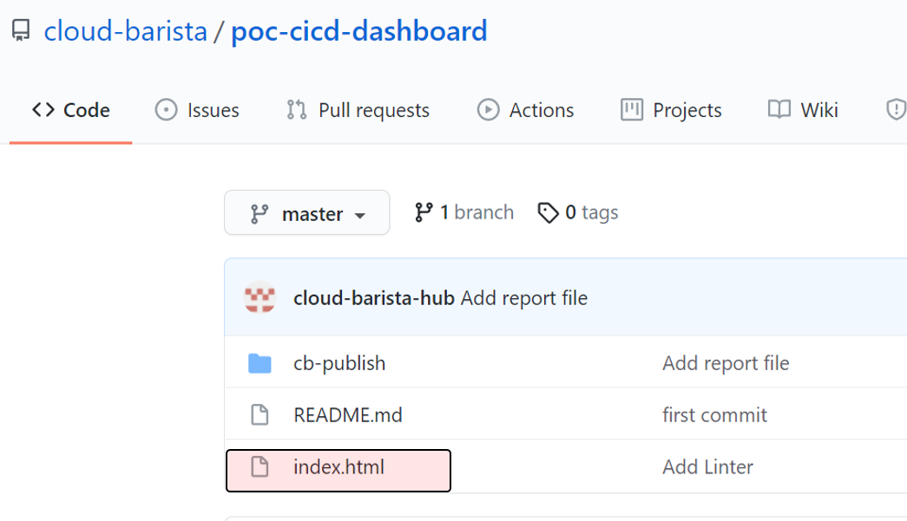

(작성중) 클라우드바리스타 CI/CD 가이드 입니다.

비고: 본 문서는 배포후에 참조(링크)하시기 바랍니다. 문서의 최종 위치가 변경될 수 있습니다.

# Cloud-Barista CI/CD 및 통합 리포트 체계 구축 가이드

**<ins>본 문서는 Cloud-Barista 커뮤니티의 각 레포지토리에 개발 워크플로 자동화(CI/CD) 및 통합 리포트 체계 적용을 돕기 위한 가이드 문서이다.</ins>** GitHub Actions를 활용하여 CI/CD 및 통합 리포트 체계를 적용하는 방법에 대하여 설명한다. 각 레포지토리의 상황은 다를 수 있으므로, 본 문서는 공통 또는 핵심적인 내용에 대하여 주로 설명한다. 따라서, 각 레포지토리의 메인테이너 및 멤버가 세부 조정할 필요가 있다.

### 목 차

- [1. 개요](#1-개요)
- [GitHub 환경 설정](#GitHub-환경-설정)
- [Workflow 파일 구성](#Workflow-파일-구성)
- [Dashboard 구축](#Dashboard-구축)
- [Unit Test 파일 구성](#Unit-Test-파일-구성)
- [CI Workflow 수정](#CI-Workflow-구축)
- [CD Workflow 수정](#CD-Workflow-구축)
- [REPORTS Workflow 수정](#REPORTS-Workflow-구축)
- [Workflow Job 추가](#Workflow-Job-추가)
- [Unit Test 시나리오 추가](#Unit-Test-시나리오-추가)

## 1. 개요

Cloud-Barista 시스템은 다양한 프레임워크로 구성되어 있고, 프레임워크별로 개발 / 운영하고 있다. 기존 프레임워크 또는 새로운 프레임워크에서 CI/CD를 적용할 수 있도록 공통 또는 핵심적인 방법을 제시하고, 실제로 구현할 수 있도록 가이드를 제공한다.  
본 가이드에서는 GitHub Actions 를 이용한 Cloud-Barista CI/CD 및 통합 리포트 체계 구축 과정을 [poc-cicd-spider](https://github.com/cloud-barista/poc-cicd-spider/tree/master/.github/workflows) 를 기준으로 [CB-SPIDER](https://github.com/cloud-barista/cb-spider) 에 적용하는 방법을 상세히 소개한다.

## [GitHub 환경 설정]

### (1) Secrets 변수 설정

- CR_PAT / REPO_ACCESS_TOKEN 의 personal access token을 생성한다. 생성방법은 [여기](https://docs.github.com/en/github/authenticating-to-github/keeping-your-account-and-data-secure/creating-a-personal-access-token)를 참고한다.

  - CR_PAT 권한 설정

    다음 그림처럼 repo / write:packages / delete:packages 선택후 토큰 생성

    <br/>
    
    <br/><br/>

  - REPO_ACCESS_TOKEN 권한 설정

    다음 그림처럼 repo 선택후 토큰 생성

    <br/>
    
    <br/><br/>

- CR_PAT / REPO_ACCESS_TOKEN / DOCKER_USERNAME / DOCKER_PASSWORD 의 Repository Scerets 변수를 등록한다. 등록방법은 [여기](https://docs.github.com/en/actions/reference/encrypted-secrets)를 참고한다.

  다음 그림처럼 Secrets->Actions 메뉴를 선택하면 등록된 변수 확인

  <br/>
  
  <br/><br/>

### (2) Self-hosted Runner 설정

- Self-hosted Runner 를 호스팅할 서버를 하나 준비한다. Self-hosted Runner 설정 방법은 [여기](https://docs.github.com/en/actions/hosting-your-own-runners/adding-self-hosted-runners)를 참고한다.

  다음 그림처럼 Actions->Runners 메뉴를 선택하면 등록된 Runner 확인

  <br/>
  
  <br/><br/>

## [Workflow 파일 구성]

### (1) .github 폴더 생성

다음 그림처럼 CB-SPIDER Repository 에 .github 폴더를 생성한다.

<br/>

<br/><br/>

### (2) .golangci.yaml 파일 복사

다음 그림처럼 .github/.golangci.yaml 파일을 CB-SPIDER Repository 의 동일 위치에 복사한다.

<br/>

<br/><br/>

### (3) workflows 폴더 생성

CB-SPIDER Repository 의 .github 폴더에서 workflows 폴더를 생성한다.

### (4) cb-ci-actions.yaml 파일 복사

다음 그림처럼 .github/workflows/cb-ci-actions.yaml 파일을 CB-SPIDER Repository 의 동일 위치에 복사한다.

<br/>

<br/><br/>

### (5) cb-cd-actions.yaml 파일 복사

.github/workflows/cb-cd-actions.yaml 파일을 CB-SPIDER Repository 의 동일 위치에 복사한다.

### (6) cb-report.yaml 파일 복사

.github/workflows/cb-report.yaml 파일을 CB-SPIDER Repository 의 동일 위치에 복사한다.

## [Dashboard 구축]

### (1) Dashboard Repository 생성

다음 그림처럼 CB-SPIDER 의 Dashboard App 을 위한 Repository 를 "cb-spider-dashboard" 로 생성한다.

<br/>

<br/><br/>

### (2) GitHub Pages 설정

다음 그림처럼 cb-spider-dashboard Repository 의 Pages 메뉴를 선택하고 Source 부분에서 Branch 를 main 으로 선택하고 Save 버튼을 클릭한다.

<br/>

<br/><br/>

### (3) Dashboard App 복사

다음 그림처럼 poc-cicd-dashboard Repository 의 index.html 파일을 cb-spider-dashboard Repository 의 동일위치에 복사한다.

<br/>

<br/><br/>

## [Unit Test 파일 구성]

### (1) Unit Test 시나리오 복사

다음 그림처럼 test/interface-test 에 있는 모든 파일을 CB-SPIDER Repository 의 동일 위치에 복사한다.

<br/>

<br/><br/>

### (2) Unit Test 실행 방법

로컬환경에서 Unit Test 를 실행하기 위해 다음처럼 test/interface-test 폴더로 이동한 다음 test.sh 스크립트를 실행한다.

```
# cd test/interface-test
# ./test.sh
```

### (3) Backend 서버 버전 변경 방법

CB-SPIDER 는 Backend 서버가 존재하지 않지만, CB-TUMBLEBUG / CB-LADYBUG 은 Backend 서버가 존재한다.
Backend 서버는 docker-compose 로 구성되어 있으며 backend 폴더의 docker-compose.yaml 파일에서 Backend 서버 버전을 변경할 수 있다.

- CB-TUMBLEBUG

Backend 서버로 cb-spider 이미지 0.4.7 버전을 이용하고 있다. 수정을 원할 경우 docker-compose.yaml 에서 cb-spider 이미지 버전을 변경할 수 있다.

```
version: "3.3"
services:

  cb-spider:
    image: cloudbaristaorg/cb-spider:0.4.7  // 사용된 cb-spider 버전
    container_name: cb-spider-backend
```

- CB-LADYBUG

Backend 서버로 cb-spider 이미지 0.4.7 버전, cb-tumblebug 이미지 0.4.2 버전을 이용하고 있다. 수정을 원할 경우 docker-compose.yaml 에서 cb-spider / cb-tumblebug 이미지 버전을 변경할 수 있다.

```
version: "3.3"
services:

  cb-spider:
    image: cloudbaristaorg/cb-spider:0.4.7 // 사용된 cb-spider 버전
    container_name: cb-spider-backend

  cb-tumblebug:
    image: cloudbaristaorg/cb-tumblebug:0.4.2 // 사용된 cb-tumblebug 버전
    container_name: cb-tumblebug-backend
```

## [CI Workflow 수정]

poc-cicd-spider 에서 복사한 cb-ci-actions.yaml 파일을 CB-SPIDER Repository 환경에 맞게 수정을 진행한다.

### (1) skip_tags 변수 활용

skip_tags 변수는 CB-ENV-JOB 의 outputs 항목에 정의되어 있어 다른 Job 에서 접근 가능하고, Workflow Job 들의 실행 여부를 제어하는데 활용될 수 있다.

```
cb-env-job:
  name: CB-ENV-JOB
  outputs:
    skip_tags: ${{ steps.cev.outputs.steps.cev.outputs.skip_tags }}
```

예로, CB-CI-SHOSTED-JOB / CB-CI-TEST-JOB / CB-CI-IMAGE-BUILD-JOB 의 실행여부를 제어해보자.
먼저, 사용자는 각 Job 의 제어를 위해 정보를 지정해야 하는데 PR 메시지나 Commit 메시지에 대괄호[] 를 사용하여 지정할 수 있다.

- [skip shosted] : 메시지에 [skip shosted] 가 포함되면 CB-CI-SHOSTED-JOB 을 실행하지 않는데 활용
- [skip test] : 메시지에 [skip test] 가 포함되면 CB-CI-TEST-JOB 을 실행하지 않는데 활용
- [skip image build] : 메시지에 [skip image build] 가 포함되면 CB-CI-IMAGE-BUILD-JOB 을 실행하지 않는데 활용

이제, CB-CI-SHOSTED-JOB / CB-CI-TEST-JOB / CB-CI-IMAGE-BUILD-JOB 각 Job 에 skip_tags 조건을 다음과 같이 지정하면 사용자의 메시지에 의해 Job 의 실행 여부를 제어하게 된다.

```
cb-ci-shosted-job:
  name: CB-CI-SHOSTED-JOB
  needs: [cb-env-job]
  if: ${{ github.repository_owner == 'cloud-barista' && !contains(needs.cb-env-job.outputs.skip_tags, '[skip shosted]') }}

cb-ci-test-job:
  name: CB-CI-TEST-JOB
  needs: [cb-env-job]
  if: ${{ github.repository_owner == 'cloud-barista' && !contains(needs.cb-env-job.outputs.skip_tags, '[skip test]') }}

cb-ci-image-build-job:
  name: CB-CI-IMAGE-BUILD-JOB
  needs: [cb-env-job]
  if: ${{ github.repository_owner == 'cloud-barista' && !contains(needs.cb-env-job.outputs.skip_tags, '[skip image build]') }}
```

skip_tags 변수 외에 author_association / branch 변수를 사용할 수 있으나 현재 주석처리 되어 있다. 주석을 제거하고 사용할 수 있으며 사용법은 skip_tags 와 유사하게 다음처럼 사용가능하다.

```
cb-ci-shosted-job:
  name: CB-CI-SHOSTED-JOB
  needs: [cb-env-job]
  if: ${{ github.repository_owner == 'cloud-barista' && !contains(needs.cb-env-job.outputs.skip_tags, '[skip shosted]') && needs.cb-env-job.outputs.author_association == 'OWNER' && needs.cb-env-job.outputs.branch == 'main' }}
```

### (2) Lint 수정

현재 Cloud-Barista 에서는 deadcode / errcheck / staticcheck / revive / gofmt / govet / gocyclo / golint / ineffassign / misspell 을 제공한다. 여기에서는 deadcode 를 삭제하는 예를 설명한다. 다른 Lint 를 추가하고자 할 경우에는 삭제 단계를 참고하여 진행한다.

- "Run Lint" Step 에서 다음의 deadcode 를 실행하는 라인 삭제

  ```
  golangci-lint run --config ./.github/.golangci.yaml --disable-all -E deadcode | tee ./outputs/deadcode-lint-result.txt
  ```

- "Run Lint" Step 에서 다음의 deadcode 디버깅 라인 삭제

  ```
  if [ -f "./outputs/deadcode-lint-result.txt" ] ; then
    echo "======= deadcode-lint-result.txt ======="
    cat ./outputs/deadcode-lint-result.txt
  fi
  ```

- CB-REPORTS-JOB 의 "Load Result Info" Step 에서 다음의 변수로 로딩하는 라인 삭제

  ```
  //
  // DEADCODE LINT RESULT LOADING
  //
  var deadcodeLintRun = 0
  var deadcodeLintResultTxt = ''
  if (fs.existsSync('./cb-artifact-test/deadcode-lint-result.txt')) {
    deadcodeLintRun = 1
    deadcodeLintResultTxt = fs.readFileSync('./cb-artifact-test/deadcode-lint-result.txt', 'utf8')
  }
  //console.log('deadcodeLintResultTxt', deadcodeLintResultTxt)
  core.setOutput('deadcodeLintResultTxt', deadcodeLintResultTxt)
  ```

- CB-REPORTS-JOB 의 "Load Result Info" Step 에서 다음의 deadcode 관련 Summary Report 라인 삭제

  ```
  var deadcodeLintCnt = 0
  if(deadcodeLintRun == 1) {
    deadcodeLintCnt = (deadcodeLintResultTxt.match(/\(deadcode\)/g) || []).length
    console.log('deadcodeLintCnt', deadcodeLintCnt)
    core.setOutput('deadcodeLintCnt', deadcodeLintCnt)
    summaryReport += '- deadcode(lint) : ' + deadcodeLintCnt + ' found\n'
  } else {
    summaryReport += '- deadcode(lint) : -\n'
  }
  ```

- CB-REPORTS-JOB 의 "Load Result Info" Step 에서 다음의 deadcode 관련 json 라인 삭제

  ```
  publishReport.lint.deadcode = {}
  publishReport.lint.deadcode.run = deadcodeLintRun
  publishReport.lint.deadcode.cnt = deadcodeLintCnt
  publishReport.lint.deadcode.details = deadcodeLintResultTxt
  ```

- cb-spider-dashboard Repository 의 index.html 에서 다음의 deadcode 관련 Dashboard josn 초기값 설정 라인 삭제

  ```
  deadcode: {
    run: 0,
    cnt: 0,
    details: ''
  },
  ```

- cb-spider-dashboard Repository 의 index.html 에서 다음의 deadcode 관련 정보뷰 라인 삭제

  ```
  <div class="col-lg-3">
      <div class="card card-stats mb-4 mb-xl-0">
          <div class="card-body" style="">
              <div class="row">
                  <div class="col">
                      <h2 class="card-title text-muted mb-0"><strong>Lint</strong><small class="ml-2 mb-0 text-muted">/ deadcode</small></h2>
                      <span class="h1 font-weight-bold mb-0 text-info" v-if="report.lint.deadcode.run == 0" >Skip</span>
                      <span class="h1 font-weight-bold mb-0" v-if="report.lint.deadcode.run == 1" v-bind:class="{ 'text-warning': report.lint.deadcode.cnt > 0, 'text-success': report.lint.deadcode.cnt == 0 }">{{ report.lint.deadcode.cnt }} found</span>
                  </div>
              </div>
              <p class="mt-3 mb-0 text-muted text-sm-right">
                  <span class="text-success mr-2"></span>
                <span class="text-sm"><a href="#details" @click="tabIndex=0">details</a></span>
              </p>
          </div>
      </div>
  </div>
  ```

- cb-spider-dashboard Repository 의 index.html 에서 다음의 deadcode 관련 details 라인 삭제

  ```
  <b-tab title="deadcode" >
    <b-card-text>
      <textarea  style="width:100%; min-height:600px;"> {{ report.lint.deadcode.details }} </textarea>
    </b-card-text>
  </b-tab>
  ```

- cb-spider-dashboard Repository 의 index.html 에서 다음의 details tabIndex 전체 수정

  아래처럼 Dashboard 정보는 details 를 클릭하면 세부 정보를 보여주는 탭으로 이동하게 된다. 이때에 tabIndex 를 사용하게 되는데, deadcode 가 삭제되어서 tabIndex 가 전체적으로 변하게 되어 모든 @click="tabIndex=" 부분을 맞게 수정해야 한다.

  ```
  <p class="mt-3 mb-0 text-muted text-sm-right">
      <span class="text-success mr-2"></span>
    <span class="text-sm"><a href="#details" @click="tabIndex=인덱스수정해야함">details</a></span>
  </p>
  ```

### (3) Converage 실행 환경 수정

CB-SPIDER Repository 에서 Unit Test 시나리오는 test/interface-test 에 위치하고 있다. 다른 위치(예로, unit-test 폴더)로 변경하고, 특정 패키지(예로, cloud-driver 관련 패키지)를 커버리지에서 제외 할 경우 다음과 같이 수정을 진행한다.

- test/interface-test 폴더에 있는 모든 파일을 unit-test 폴더로 이동한다.

- unit-test/test.env 에서 CBSPIDER_ROOT 환경변수를 다음과 같이 수정한다.

```
export CBSPIDER_ROOT=$HOME/go/src/github.com/cloud-barista/cb-spider/unit-test
```

- unit-test/test.sh 에서 go test 의 coverpkg 옵션에서 "go list ../../..." 를 "go list ../..." 로 수정하고, "grep -v cloud-driver" 를 다음과 같이 추가한다. test/interface-test 일 때는 cb-spider ROOT 까지 상대 경로로 ../../ 를 해야 하지만, unit-test 일 때는 ROOT 까지 ../ 를 하면 되게 된다.

```
go test -p 1  -v -coverpkg=$(go list ../... | grep -v interface-test  | grep -v protobuf | grep -v cloud-driver | tr "\n" ",")  -coverprofile=profile.cov ./...
```

- .github/workflows/cb-ci-actions.yaml 에서 "Run Coverage" Step 을 다음과 같이 수정한다. go test 의 coverpkg 옵션에서 "go list ../../..." 를 "go list ../..." 로 수정하고, "grep -v cloud-driver" 를 추가한다. "../../outputs" 경로는 "../outputs" 로 수정한다.

```
- name: Run Coverage
  env:
    CBSPIDER_ROOT: ${{ github.workspace }}/unit-test // 경로 수정
    CBSTORE_ROOT: ${{ github.workspace }}/unit-test // 경로 수정
    CBLOG_ROOT: ${{ github.workspace }}/unit-test // 경로 수정
    LOCALHOST: OFF
    PLUGIN_SW: OFF
    MEERKAT: OFF
  run: |
    cd ${{ github.workspace }}/unit-test  // 경로 수정
    (go test -p 1 -v -coverpkg=$(go list ../... | grep -v interface-test | grep -v protobuf | grep -v cloud-driver | tr "\n" ",")  -coverprofile=../outputs/coverage.txt ./... > ../outputs/coverage.log 2>&1; echo $? > ../outputs/coverage.check ) || true // go list 경로와 outputs 경로 수정, grep -v cloud-driver 추가

    cd ${{ github.workspace }}
```

### (4) go build 버전 추가

golang build 테스트는 현재 1.16 버전 하나만 수행하고 있다. 만약, 향후 추가되는 golang 버전(예로, 1.17 버전)을 추가하여 build 테스트를 수행하고자 할 경우 다음과 같이 수정을 진행한다.

- CB-CI-GOBUILD-MATRIX-JOB 에서 matrix 의 go 필드에 1.17 golang 버전을 다음과 같이 수정한다.

```
cb-ci-gobuild-matrix-job:
  name: CB-CI-GOBUILD-MATRIX-JOB
  if: ${{ github.repository_owner == 'cloud-barista' }}
  runs-on: ubuntu-latest
  needs: [cb-env-job]
  strategy:
    matrix:
      go: ["1.16", "1.17"] // 1.17 버전 추가
```

## [CD Workflow 수정]

poc-cicd-spider 에서 복사한 cb-cd-actions.yaml 파일을 CB-SPIDER Repository 환경에 맞게 수정을 진행한다.

### (1) 이미지 이름 변경

CB-CD-IMAGE-DEPLOY-JOB 에서 IMAGE_NAME 필드 값을 "poc-cicd-spider" 에서 "cb-spider" 로 수정한다.

```
cb-cd-image-deploy-job:
  name: CB-CD-IMAGE-DEPLOY-JOB
  if: ${{ github.repository_owner == 'cloud-barista' }}
  runs-on: ubuntu-latest
  needs: [cb-env-job]
  env:
    DOCKER_REPO: cloudbaristaorg
    IMAGE_NAME: cb-spider // CB-SPIDER 의 이미지 이름으로 변경
```

## [REPORTS Workflow 수정]

poc-cicd-spider 에서 복사한 cb-report.yaml 파일을 CB-SPIDER Repository 환경에 맞게 수정을 진행한다.

### (1) Dashboard Repository 변경

CB-REPORTS-JOB 에서 DASHBOARD_REPO 필드 값을 "poc-cicd-dashboard" 에서 Dashboard Repository 이름 "cb-spider-dashboard" 로 수정한다.

```
cb-reports-job:
  name: CB-REPORTS-JOB
  if: ${{ github.repository_owner == 'cloud-barista' && github.event.workflow_run.conclusion == 'success' }}
  runs-on: ubuntu-latest
  env:
    DASHBOARD_REPO: cb-spider-dashboard // CB-SPIDER 의 Dashboard Repository 이름으로 변경
```

## [Workflow Job 추가]

Cloud-Barista CI/CD Workflow 에 간단한 CB-CI-ECHO-JOB 을 추가하는 방법을 설명한다. 새로운 Job 을 추가하는 방법을 이해하고 Reports 와 Dashboard 에 이르는 프로세스를 전체적으로 파악하도록 한다. CB-CI-ECHO-JOB 는 echo 명령어로 출력한 문자열을 Dashboard 에 보여주는 작업을 수행한다.

### (1) Echo Job 생성

CB-CI-ECHO-JOB 을 아래처럼 추가한다. CB-CI-ECHO-JOB 의 Step 은 "Make Output Folder", "Hello World", "Upload Result" 3개로 구성된다.

```
cb-ci-echo-job:
  name: CB-CI-ECHO-JOB
  if: ${{ github.repository_owner == 'cloud-barista' }}
  runs-on: ubuntu-latest
  needs: [cb-env-job]
  steps:
    - name: Make Output Folder
    - name: Hello World
    - name: Upload Result
```

### (2) Output 폴더 생성 Step 작성

결과 파일을 저장할 폴더를 생성하기 위해 "Make Output Folder" Step 을 다음처럼 추가한다.

```
- name: Make Output Folder
  run: |
    mkdir -p ./outputs
```

### (3) Echo Step 작성

echo 문자열을 출력하고 저장하는 "Hello World" Step 을 다음처럼 추가한다. echo.check 에는 echo 실행 성공 여부가 저장되고, echo.log 에는 출력 문자열이 저장된다.

```
- name: Hello World
  run: |
    (echo "Hello World"  > ./outputs/echo.log 2>&1; echo $? > ./outputs/echo.check ) || true
    if [ -f "./outputs/echo.check" ] ; then
      echo "======= echo.check ======="
      cat ./outputs/echo.check
    fi
    if [ -f "./outputs/echo.log" ] ; then
      echo "======= echo.log ======="
      cat ./outputs/echo.log
    fi
```

### (4) Result 를 Artifact 로 업로드

outputs 폴더에 있는 파일을 cb-artifact-echo 로 압축하여 Artifacts 로 업로드하기 위해 "Upload Result" Step 을 다음처럼 추가한다. "cb-artifact-echo" 은 다른 Job 에서 사용하지 않은 이름으로 정의한다. 동일한 이름이 존재할 경우 기존 파일을 덮어쓰게 된다.

```
- name: Upload Result
  uses: actions/upload-artifact@v2
  with:
    name: cb-artifact-echo
    path: outputs/
```

### (5) Artifact 에서 Result 다운로드

CB-REPORTS-JOB 의 "Download cb-cd-actions-artifact" Step 에서 CB-CI-ECHO-JOB 에서 업로드된 결과파일이 다운로드 된다.

```
- name: Download cb-cd-actions-artifact
  if: ${{ github.event.workflow.name == 'CB-CD-ACTIONS-WORKFLOW' }}
  uses: dawidd6/action-download-artifact@v2
  with:
    github_token: ${{secrets.GITHUB_TOKEN}}
    workflow: cb-cd-actions.yaml
    workflow_conclusion: success
```

### (6) Result 파일 정보 로딩

- echo.check 파일 내용을 echoRun / echoCheck 변수로 로딩하는 라인을 다음처럼 추가한다.

  ```
  //
  // ECHO CHECK RESULT LOADING
  //
  var echoRun = 0
  var echoCheck = 0
  if (fs.existsSync('./cb-artifact-echo/echo.check')) {
    echoRun = 1
    echoCheck = Number(fs.readFileSync('./cb-artifact-echo/echo.check', 'utf8'))
  }
  //console.log('echoCheck', echoCheck)
  core.setOutput('echoCheck', echoCheck)
  ```

- echo.log 파일 내용을 echoLog 변수로 로딩하는 라인을 다음처럼 추가한다.

  ```
  //
  // ECHO LOG RESULT LOADING
  //
  var echoLog = ''
  if (fs.existsSync('./cb-artifact-echo/echo.log')) {
    echoLog = fs.readFileSync('./cb-artifact-echo/echo.log', 'utf8')
  }
  //console.log('echoLog', echoLog)
  core.setOutput('echoLog', echoLog)
  ```

### (7) Summary Result 통합

Summary Report 에 echo 의 성공여부를 보여줄 수 있도록 다음처럼 추가한다.

```
if(echoRun == 1) {
  if(echoCheck != 0) {
    summaryReport += '- echo : fail\n'
  } else {
    summaryReport += '- echo : success\n'
  }
} else {
  summaryReport += '- echo : -\n'
}
```

### (8) Dashboard Json 통합

Dashboard 에 echo 정보를 전달하기 위해 다음처럼 json 필드를 추가한다.

```
publishReport.echo = {}
publishReport.echo.run = echoRun
publishReport.echo.check = echoCheck
publishReport.echo.details = echoLog
```

### (9) Dashboard App 수정

- cb-spider-dashboard Repository 의 index.html 에서 json 초기화 부분에 다음처럼 echo 필드를 추가한다.

  ```
  echo: {
    run: 0,
    check: 0,
    details: ''
  }
  ```

- cb-spider-dashboard Repository 의 index.html 에서 다음의 echo details 탭을 추가한다. 존재하는 탭의 가장 마지막에 위치하게 한다. 그러면, tabIndex 가 15번이 되게 된다. tabIndex 는 \<b-tab\>\</b-tab\>" 의 순번이라고 생각하면 된다.

  ```
  <b-tab title="echo" >
    <b-card-text>
      <textarea  style="width:100%; min-height:600px;"> {{ report.echo.details }} </textarea>
    </b-card-text>
  </b-tab>
  ```

- cb-spider-dashboard Repository 의 index.html 에서 다음처럼 echo 관련 정보뷰 라인을 추가한다. 다른 정보와 구분하기 위해 새로운 row 에 echo 정보 하나만 표시한다. 세부정보를 보기위해 @click="tabIndex=15" 처럼 클릭이벤트가 발생하면 tabIndex 가 15번으로 설정하게 하면 echo 탭이 보여지게 된다.

  ```
  <div class="row" style="margin-top:5px;">

      <div class="col-lg-6">
        <div class="card card-stats mb-4 mb-xl-0">
            <div class="card-body" style="">
                <div class="row">
                    <div class="col">
                      <h2 class="card-title text-muted mb-0"><strong>Echo</strong><small class="ml-2 mb-0 text-muted">/ Hello World </small></h2>
                      <span class="h1 font-weight-bold mb-0 text-info" v-if="report.echo.run == 0" >Skip</span>
                      <span class="h1 font-weight-bold mb-0 text-danger" v-if="report.echo.run == 1 && report.echo.check > 0" >Error</span>
                      <span class="h1 font-weight-bold mb-0 text-success" v-if="report.echo.run == 1 && report.echo.check == 0" >Success</span>
                    </div>
                </div>
                <p class="mt-3 mb-0 text-muted text-sm-right">
                  <span class="text-success mr-2"></span>
                  <span class="text-sm"><a href="#details" @click="tabIndex=15">details</a></span>
                </p>
            </div>
        </div>
    </div>

  </div>
  ```

## [Unit Test 시나리오 추가]

Unit Test 시나리오를 추가하고자 할 경우 다음을 참고한다. 간단한 Cloud OS 목록을 출력하는 REST API 시나리오를 기준으로 설명한다.

### (1) REST API 시나리오 파일 생성

REST API 시나리오는 test/interface-test 아래의 rest-scenario 폴더에 시나리오 파일을 생성한다. 만약, GO API 시나리오 경우에는 go-scenario 폴더에 생성하고, CLI 시나리오 경우에는 cli-scenario 폴더에 생성하면 된다.

test/interface-test/rest-scenario/rest_cloud_os.go 파일을 생성한다.

### (2) REST API 시나리오 환경 구성

Test 로 시작하는 TestCloudOS() 함수를 만든다. TestCloudOS() 함수 안에서 여러 시나리오를 여러개의 t.Run() 함수로 구성할 수 있지만, "sample rest api scenario" 이름으로 하나의 시나리오 생성한다. 하나의 시나리오에는 여러개의 Test Case 를 포함하여 구성할 수 있다. 시나리오를 실행할 때마다 테스트 환경을 초기화 해야 한다. REST API 에서는 시나리오 시작하기 전에 SetUpForRest() 를 호출하고, 시나리오가 끝나면 TearDownForRest() 함수를 호출한다. 그리고, GO API 시나리오 경우에는 SetUpForGrpc() / TearDownForGrpc() 함수를 호출하고, CLI 시나리오 경우에는 SetUpForCli() / TearDownForCli() 함수를 호출한다.

```
package restscenario

import (
	"net/http"
	"testing"
)

func TestCloudOS(t *testing.T) {
  t.Run("sample rest api scenario", func(t *testing.T) {

    SetUpForRest()


    TearDownForRest()
  })
}
```

### (3) TestCase 생성

Cloud OS 목록을 출력하는 Test Case 를 만들기 위해 TestCases{} 구조체를 이용하게 된다. TestCases{} 구조체에 REST API 핸들러 함수를 호출할 수 있는 정보를 설정하여 EchoTest() 함수를 호출하면 하나의 Test Case 가 완료된다. Test Case 성공 여부는 TestCases{} 구조체의 ExpectBodyStartsWith / ExpectBodyContains 필드를 이용하여 판단한다. ExpectBodyStartsWith 는 Test Case 의 응답 문자열을 ExpectBodyStartsWith 에 정의된 문자열과 처음부터 비교하여 성공 여부를 판단하며, ExpectBodyContains 는 Test Case 의 응답 문자열에서 ExpectBodyContains 에 정의된 문자열이 포함 되었는지를 이용하여 성공 여부를 판단한다. 그리고, GO API 시나리오 경우에는 Test Case 를 실행하는 함수는 MethodTest() 를 제공하고, CLI 시나리오 경우에는 SpiderCmdTest() 를 제공한다.

```
package restscenario

import (
	"net/http"
	"testing"
)

func TestCloudOS(t *testing.T) {
  t.Run("sample rest api scenario", func(t *testing.T) {

    SetUpForRest()

    tc := TestCases{
      Name:                 "list cloud os",
      EchoFunc:             "ListCloudOS",
      HttpMethod:           http.MethodGet,
      WhenURL:              "/spider/cloudos",
      GivenQueryParams:     "",
      GivenParaNames:       nil,
      GivenParaVals:        nil,
      GivenPostData:        "",
      ExpectStatus:         http.StatusOK,
      ExpectBodyStartsWith: `{"cloudos":[`,
      //ExpectBodyContains:   "",
    }
    EchoTest(t, tc)

    TearDownForRest()
  })
}
```
